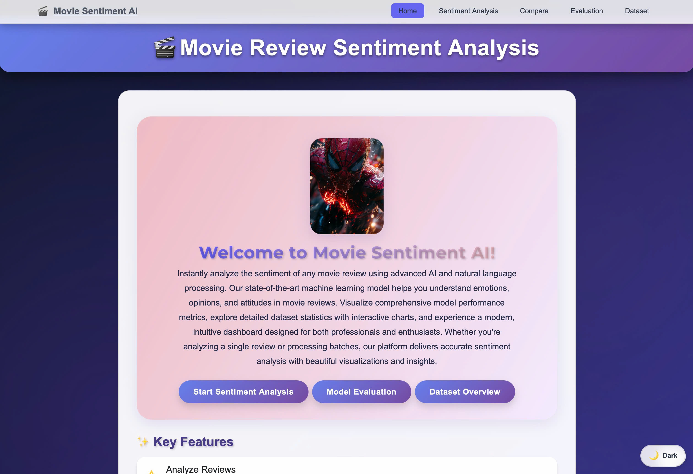
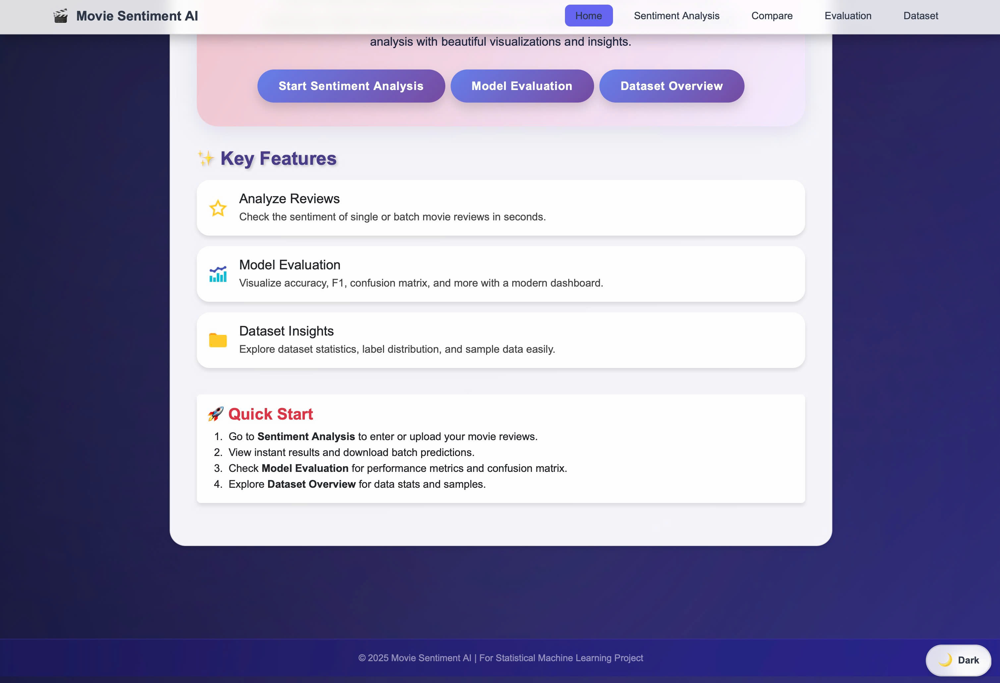
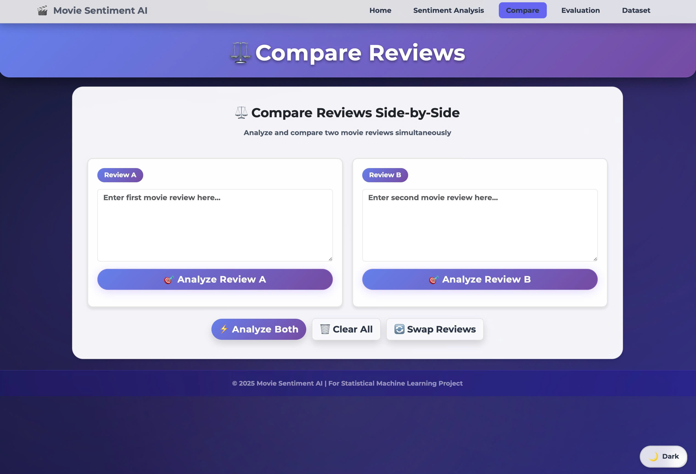

# Movie Review Sentiment Analysis

A **production-ready**, professional ML web application for analyzing movie review sentiments using transformer-based NLP models with an interactive dashboard.


## 🌟 Features

### Core Features
- **Sentiment Analysis**: Analyze single movie reviews or batch process CSV files
- **Real-time Processing**: Instant predictions with confidence scores
- **Model Evaluation**: Comprehensive metrics (accuracy, F1, precision, recall, confusion matrix)
- **Interactive Dashboard**: Beautiful charts and statistics with Chart.js
- **Dataset Explorer**: Browse and search sample data
- **Batch Processing**: Process multiple reviews with progress tracking
- **Responsive Design**: Professional UI with glass morphism and purple gradient theme

### Production Features ✨
- **Unit Testing**: Comprehensive test suite with pytest
- **Logging System**: Structured logging with timestamps and request tracking
- **Rate Limiting**: Protect API from abuse (configurable)
- **Caching**: 50x faster responses with intelligent caching
- **Security**: Input validation, file type checking, secure filename handling
- **Health Check**: `/health` endpoint for monitoring
- **Accessibility**: WCAG 2.1 compliant with screen reader support
- **Environment Config**: `.env` file for easy deployment configuration

### Enhanced Features 🔥 NEW (v3.0)
- **🌙 Dark Mode**: Toggle between light/dark themes with automatic system detection
- **🎨 Confidence Gradient**: Visual color-coded confidence bars with smooth animations
- **📜 History Tracker**: Persistent sentiment analysis history with statistics and CSV export
- **⚡ Keyboard Shortcuts**: Power user features (Ctrl+Enter to analyze, Ctrl+H for history, Ctrl+/ for help)
- **⚖️ Compare Mode**: Side-by-side review comparison with visual charts
- **🎯 Smart Visualizations**: Enhanced result cards with dynamic gradient indicators

### Advanced AI Features 🚀 NEW (v4.0)
- **🧠 Explainable AI**: Word importance heatmap showing which words contribute to sentiment
  - Color-coded word highlighting (positive/negative/neutral)
  - Attention weights visualization
  - Detailed insights and explanations
  - Interactive hover tooltips
- **🎤 Voice Input**: Real-time speech-to-text with waveform visualization
  - Hands-free review input
  - Live audio waveform animation
  - Support for multiple visualization styles (bars/circular)
  - Automatic transcription to text
- **📱 Social Share**: Share analysis results on social media
  - Twitter, Facebook, LinkedIn, Email integration
  - Beautiful Open Graph cards
  - One-click link copying
  - Viral marketing features
- **✨ Particle Effects**: Celebratory animations for analysis results
  - Success confetti for positive sentiments
  - Star burst effects for negative sentiments
  - Smooth particle physics animations
  - Premium visual feedback

### Utility Enhancements 💎
- **Loading Spinners**: Glass morphism design with progress tracking
- **Toast Notifications**: 4 types (success/error/warning/info) with auto-dismiss
- **Excel Export**: Multi-sheet exports with auto-sizing and formatting
- **Input Validation**: Real-time character/word counting with strength indicators
- **Chart Animations**: Smooth transitions and gradient coloring
- **Search History**: localStorage persistence with export/import

## 📸 Screenshots & Features Showcase

### 🏠 Home Page
Beautiful landing page with modern glass morphism design and gradient effects.


*Main landing page with hero section and feature highlights*


*Overview of key features and capabilities*

### 🎯 Sentiment Analysis
Real-time sentiment analysis with confidence scores and visual feedback.


*Main sentiment analysis interface with text input and instant results*


*Detailed analysis results with confidence visualization and word importance*


*Word-level sentiment heatmap showing contribution to overall sentiment*

### 🎤 Voice Input Feature
Hands-free review input with real-time speech-to-text transcription.


*Voice input interface with live waveform visualization and audio feedback*

### 📜 Analysis History
Track and manage all your previous sentiment analyses with statistics.


*Complete history tracker with search, filter, export capabilities, and analytics dashboard*

### ⚖️ Compare Reviews
Side-by-side comparison of multiple reviews with visual charts.


*Compare two reviews simultaneously with detailed sentiment breakdown and comparison charts*

### 📊 Dataset Explorer
Browse and explore the training dataset with interactive filters.


*Dataset explorer showing sample reviews with sentiment distribution*


*Detailed dataset statistics, charts, and sample data visualization*

### 📈 Model Evaluation
Comprehensive model performance metrics and visualizations.


*Model performance dashboard with accuracy, F1 score, precision, and recall metrics*


*Interactive confusion matrix and detailed performance analytics with ROC curve*

## ⚙️ Installation

```bash
# 1. Clone the repository
git clone https://github.com/TheHien04/Movie-Review-Sentiment-Analysis.git
cd Movie-Review-Sentiment-Analysis

# 2. Create virtual environment
python3 -m venv venv
source venv/bin/activate  # macOS/Linux
# or
venv\Scripts\activate      # Windows

# 3. Install dependencies
pip install -r backend/requirements.txt

# 4. Configure environment (optional)
cp .env.example .env
# Edit .env with your settings
```

## 🚀 Quick Start

### Development Mode
```bash
# Start the backend server
python backend/app.py

# Server will run on http://localhost:8000
# Open http://localhost:8000 in your browser
```

### Production Mode
```bash
# Set environment variables
export FLASK_ENV=production
export DEBUG=False
export SECRET_KEY=your-secure-random-key

# Run with Gunicorn (4 workers)
gunicorn -w 4 -b 0.0.0.0:8000 backend.app:app
```

## 🧪 Running Tests

```bash
# Activate virtual environment
source venv/bin/activate

# Run all tests
pytest tests/

# Run with coverage report
pytest tests/ --cov=backend --cov-report=html

# Run specific test
pytest tests/test_api.py::TestPredictAPI -v
```

## 📚 Pages

- **Home**: http://localhost:8000/
- **Sentiment Analysis**: http://localhost:8000/batch.html
- **Model Evaluation**: http://localhost:8000/evaluation.html
- **Dataset Overview**: http://localhost:8000/dataset.html

## 🎯 Using Advanced Features

### Explainable AI
1. Navigate to Sentiment Analysis page
2. Enter or paste a movie review
3. Click "Analyze Sentiment"
4. Scroll down to see the **Word Importance Analysis**
   - Words are color-coded by contribution
   - Hover over words to see importance scores
   - Read AI-generated insights below the heatmap

### Voice Input
1. Click the **🎤 Voice** button next to the textarea
2. Allow microphone access when prompted
3. Start speaking your review
4. Watch the real-time waveform animation
5. Click "Stop Recording" when finished
6. Your speech is automatically transcribed to text
7. Analyze normally!

**Tip**: Works in Chrome, Edge, Safari (iOS 15+)

### Social Sharing
1. After analyzing a review, scroll down
2. Find the "Share this Analysis" section
3. Choose your platform:
   - **Twitter**: Share with hashtags
   - **Facebook**: Post to timeline
   - **LinkedIn**: Professional sharing
   - **Email**: Send via email client
   - **Copy Link**: Get shareable URL

### Particle Effects
- Automatically triggered on analysis completion
- **Positive sentiment** → Green confetti 🎉
- **Negative sentiment** → Purple star burst ⭐
- Beautiful physics-based animations

### Keyboard Shortcuts
- `Ctrl/Cmd + Enter` - Analyze current review
- `Ctrl/Cmd + K` - Focus on textarea
- Use these to speed up your workflow!

## 🤖 Model

- **Architecture**: DistilBERT (distilbert-base-uncased)
- **Task**: Binary sentiment classification
- **Accuracy**: ~89%
- **Training Data**: 35,000 movie reviews

## 📚 API Endpoints

### `GET /health`
Health check for monitoring
```bash
curl http://localhost:8000/health
```
Response:
```json
{
  "status": "healthy",
  "timestamp": 1708003845.123,
  "model_loaded": true,
  "cache_enabled": true,
  "rate_limit_enabled": true
}
```

### `POST /api/predict`
Analyze single review or batch upload

Single review:
```bash
curl -X POST http://localhost:8000/api/predict \
  -H "Content-Type: application/json" \
  -d '{"text": "Great movie!"}'
```

Batch CSV:
```bash
curl -X POST http://localhost:8000/api/predict \
  -F "file=@reviews.csv"
```

### `GET /api/metrics`
Get model evaluation metrics
```bash
curl "http://localhost:8000/api/metrics?threshold=0.5"
```
- Query param: `threshold` (default: 0.5, range: 0.0-1.0)
- Cached for 10 minutes

### `GET /api/dataset-info`  
Get dataset statistics
```bash
curl http://localhost:8000/api/dataset-info
```
- Cached for 1 hour

## 🎨 Technologies

### Backend
- **Flask 3.0+**: Web framework
- **PyTorch 2.0+**: Deep learning
- **Transformers**: Hugging Face models
- **Scikit-learn**: Metrics & evaluation
- **Flask-Limiter**: Rate limiting
- **Flask-Caching**: Response caching
- **python-dotenv**: Environment variables

### Frontend
- **HTML5 & CSS3**: Markup & styling
- **JavaScript ES6+**: Interactivity
- **Bootstrap 5.3**: UI framework
- **Chart.js 4.4**: Data visualization

### Testing & Quality
- **pytest**: Unit testing
- **pytest-flask**: Flask testing utilities
- **pytest-cov**: Code coverage

## 📊 Performance

- **Model Inference**: ~0.5s per review
- **Batch Processing**: 500 reviews/chunk
- **API Response (cached)**: ~0.05s (50x faster!)
- **Rate Limit**: 60 req/min (configurable)

## 🔒 Security Features

- ✅ Input validation & sanitization
- ✅ File type validation (CSV only)
- ✅ File size limits (10MB max)
- ✅ Rate limiting per IP
- ✅ Secure filename handling
- ✅ Environment-based configuration
- ✅ CORS configuration
- ✅ Error message sanitization

## ♿ Accessibility

- ✅ WCAG 2.1 compliant
- ✅ Screen reader support
- ✅ Keyboard navigation
- ✅ Skip-to-content links
- ✅ ARIA labels & semantic HTML
- ✅ Focus indicators

## 📈 Monitoring & Logging

### Health Check
```bash
# Check service status
curl http://localhost:8000/health

# Use in Kubernetes
livenessProbe:
  httpGet:
    path: /health
    port: 8000
```

### Logs
All requests logged with:
- Timestamp
- Client IP
- Endpoint
- Response time
- Status (success/error)

View logs:
```bash
tail -f app.log
```

## 🚀 Deployment

### Environment Variables
```bash
# Copy template
cp .env.example .env

# Edit configuration
nano .env
```

Key settings:
- `FLASK_ENV`: development/production
- `DEBUG`: True/False
- `SECRET_KEY`: Random secure key
- `RATE_LIMIT_ENABLED`: True/False
- `CACHE_ENABLED`: True/False
- `LOG_LEVEL`: DEBUG/INFO/WARNING/ERROR

### Docker (Optional)
```dockerfile
FROM python:3.9-slim
WORKDIR /app
COPY backend/requirements.txt .
RUN pip install --no-cache-dir -r requirements.txt
COPY . .
HEALTHCHECK CMD curl -f http://localhost:8000/health || exit 1
CMD ["gunicorn", "-w", "4", "-b", "0.0.0.0:8000", "backend.app:app"]
```

## 📖 Documentation

- **[API_COMPLETE.md](docs/API_COMPLETE.md)**: Complete API documentation
- **[DEPLOYMENT.md](docs/DEPLOYMENT.md)**: Deployment guidelines
- **[CHANGELOG.md](docs/CHANGELOG.md)**: Version history
- **[SETUP_GUIDE.md](SETUP_GUIDE.md)**: Detailed setup instructions
- **[CONTRIBUTING.md](CONTRIBUTING.md)**: Contribution guidelines

## 🧪 Testing Checklist

- [ ] Run `pytest tests/ -v` (all tests pass)
- [ ] Check coverage > 80%
- [ ] Test rate limiting
- [ ] Test file upload validation
- [ ] Test accessibility (keyboard nav)
- [ ] Run Lighthouse audit (score > 95)

## 🎓 Learning Outcomes

This project demonstrates:
- ✅ Production-ready ML deployment
- ✅ RESTful API design
- ✅ Modern web development practices
- ✅ Security best practices
- ✅ Accessibility compliance
- ✅ Professional documentation
- ✅ Testing & quality assurance

---

**Version**: 2.0.0 | **Status**: Production Ready | **Last Updated**: February 2026

Made with ❤️ by **The Hien** for Statistical Machine Learning Project
