# CineSentiment: IMDB Movie Review Sentiment Analysis

### A reproducible DistilBERT pipeline with statistical evaluation and a production-style serving stack

[](https://github.com/TheHien04/Movie-Review-Sentiment-Analysis/actions/workflows/ci-cd.yml)
[](LICENSE)
[](https://www.python.org/)
[](VERSION)

| | |
|---|---|
| **System** | CineSentiment |
| **Task** | Binary sentiment classification (Fresh / Rotten) |
| **Primary model** | Fine-tuned DistilBERT (`distilbert-base-uncased`) |
| **Dataset** | IMDB 50,000 labelled English movie reviews |
| **Held-out test** | *n* = 7,500 · accuracy 91.76% · F1 91.80% · ROC-AUC 97.35% |
| **Uncertainty** | Percentile bootstrap 95% CI, 500 resamples, seed 42 |
| **Version** | 2.3.0 |
| **Licence** | MIT |

**Abstract.** This repository presents an end-to-end system for binary sentiment classification of English movie reviews. A DistilBERT encoder is fine-tuned on a stratified 70/15/15 partition of IMDB, evaluated once on a held-out test split with bootstrap confidence intervals, and compared against a pre-registered TF-IDF + logistic regression baseline under McNemar and bootstrap-difference tests. The same checkpoint is served through a Flask product API and a parallel FastAPI v2 surface, with a cinema-themed workbench for single/batch inference, token-level attribution, and a metrics dashboard bound to versioned artefacts. The design follows a C4 software decomposition, a held-out evaluation protocol (train-only fitting, validation for selection, test reported once), and a pre-registered classical baseline. Evidence: [docs/STATS_REPORT.md](docs/STATS_REPORT.md). Methods: [docs/THEORY.md](docs/THEORY.md).

**Keywords:** sentiment analysis; DistilBERT; IMDB; hold-out evaluation; bootstrap; paired tests.

---

## Contents

1. [Research question and contributions](#1-research-question-and-contributions)
2. [System architecture](#2-system-architecture)
3. [AI and ML architecture](#3-ai-and-ml-architecture)
4. [Theoretical framework](#4-theoretical-framework)
5. [Experimental protocol](#5-experimental-protocol)
6. [Results](#6-results)
7. [Reproducibility contract](#7-reproducibility-contract)
8. [User interface](#8-user-interface)
9. [Application programming interface](#9-application-programming-interface)
10. [Repository layout](#10-repository-layout)
11. [Quality assurance and continuous integration](#11-quality-assurance-and-continuous-integration)
12. [Deployment](#12-deployment)
13. [Limitations](#13-limitations)
14. [Documentation index](#14-documentation-index)
15. [Citation](#15-citation)

---

## 1. Research question and contributions

**Research question.** Does a fine-tuned DistilBERT classifier achieve *reportable* generalisation on a held-out IMDB test split (point estimates with bootstrap confidence intervals), and does it outperform a classical TF-IDF + logistic regression baseline under a fixed, stratified data protocol?

Paired error analysis (McNemar) and metric-difference tests are reported honestly: on this split the two models are **statistically tied** at α = 0.05. DistilBERT is retained as the serving model for transfer, calibration, and explainability—not because hypothesis tests proved dominance. See [docs/STATS_REPORT.md](docs/STATS_REPORT.md) and [docs/DEFENSE_SLIDE_LIMITATIONS.md](docs/DEFENSE_SLIDE_LIMITATIONS.md).

**Contributions.**

1. **Protocol.** Deterministic, stratified IMDB splits; train-only fitting; test metrics reported once.
2. **Evaluation.** Accuracy, F1, precision, recall, ROC-AUC, Brier, ECE, confusion-derived rates, and 95% bootstrap CIs.
3. **Comparison.** Nested TF-IDF baselines (logistic regression, naïve Bayes, calibrated Linear SVM) plus McNemar, bootstrap Δ, effect sizes, and Bonferroni correction.
4. **Serving architecture.** Dual HTTP surfaces, health/readiness probes, optional RAG/agent path, and Compose/Helm delivery.
5. **Workbench.** Cinema UI bound to `evaluation.json` so examiners inspect the same numbers as the written report.
6. **AI architecture (CS diagrams).** Use-case, layered, neural, activity, sequence, state, data-flow, and module views of every ML function that is actually implemented (README §3, Figures M.1–M.15).
7. **Theoretical framework.** Hold-out protocol, two representation families, decision rule, bootstrap CIs, and paired tests — mapped onto artefacts (README §4, [docs/THEORY.md](docs/THEORY.md)).

---

## 2. System architecture

The architecture is specified at four levels, following the C4 model (Brown, 2018): **context**, **containers**, **components**, and **code-level sequences**. Figure numbers **A.1–A.8** match [docs/ARCHITECTURE.md](docs/ARCHITECTURE.md). UI screenshots remain Figures 1–16 ([docs/FIGURES.md](docs/FIGURES.md)).

### 2.1 Context — what the system is

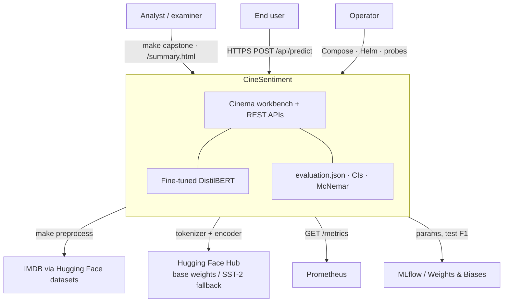
```mermaid
flowchart TB
    Analyst["Analyst / examiner"]
    User["End user"]
    Operator["Operator"]

    subgraph Cine["CineSentiment"]
        direction TB
        Workbench["Cinema workbench + REST APIs"]
        Model["Fine-tuned DistilBERT"]
        Evidence["evaluation.json · CIs · McNemar"]
        Workbench --- Model
        Workbench --- Evidence
    end

    IMDB["IMDB via Hugging Face datasets"]
    Hub["Hugging Face Hub<br/>base weights / SST-2 fallback"]
    Prom["Prometheus"]
    Track["MLflow / Weights & Biases"]

    Analyst -->|make capstone · /summary.html| Cine
    User -->|HTTPS POST /api/predict| Cine
    Operator -->|Compose · Helm · probes| Cine
    Cine -->|make preprocess| IMDB
    Cine -->|tokenizer + encoder| Hub
    Cine -->|GET /metrics| Prom
    Cine -->|params, test F1| Track
```

**Figure A.1.** System context. CineSentiment is a single bounded context: movie-review sentiment as a service plus an evaluation workbench. Raw IMDB CSVs are regenerated locally and are not stored in git.

### 2.2 Containers — main runtime architecture

This is the **principal architecture diagram**: independently deployable processes and durable stores.

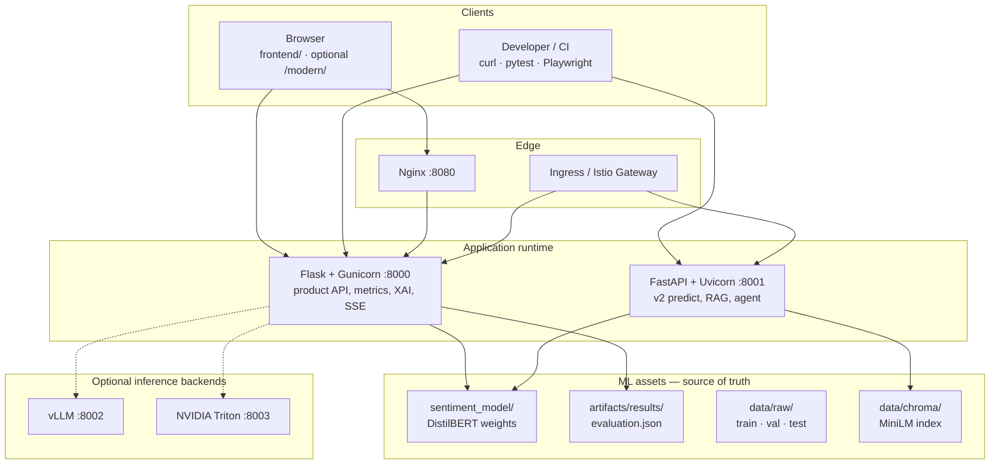
```mermaid
flowchart TB
    subgraph Clients["Clients"]
        Browser["Browser<br/>frontend/ · optional /modern/"]
        Dev["Developer / CI<br/>curl · pytest · Playwright"]
    end

    subgraph Edge["Edge"]
        Nginx["Nginx :8080"]
        Ingress["Ingress / Istio Gateway"]
    end

    subgraph Runtime["Application runtime"]
        Flask["Flask + Gunicorn :8000<br/>product API, metrics, XAI, SSE"]
        FastAPI["FastAPI + Uvicorn :8001<br/>v2 predict, RAG, agent"]
    end

    subgraph Optional["Optional inference backends"]
        vLLM["vLLM :8002"]
        Triton["NVIDIA Triton :8003"]
    end

    subgraph Assets["ML assets — source of truth"]
        Weights["sentiment_model/<br/>DistilBERT weights"]
        Eval["artifacts/results/<br/>evaluation.json"]
        Splits["data/raw/<br/>train · val · test"]
        Chroma["data/chroma/<br/>MiniLM index"]
    end

    Browser --> Nginx
    Browser --> Flask
    Dev --> Flask
    Dev --> FastAPI
    Nginx --> Flask
    Ingress --> Flask
    Ingress --> FastAPI
    Flask --> Weights
    Flask --> Eval
    FastAPI --> Weights
    FastAPI --> Chroma
    Flask -.-> vLLM
    Flask -.-> Triton
```

**Figure A.2.** Main container architecture. Flask (:8000) is the product and academic surface. FastAPI (:8001) is a typed v2 API. DistilBERT weights and `evaluation.json` are the two authoritative runtime artefacts. Remote backends (vLLM, Triton) are selected with `INFERENCE_BACKEND` and are off by default.

| Container | Technology | Responsibility |
|-----------|------------|----------------|
| Cinema UI | HTML5, Bootstrap 5, Chart.js | Analyse, compare, metrics, insights, developer portal |
| React SPA | Vite, React 18, TypeScript | Optional `/modern/` surface |
| Flask API | Flask 3, Gunicorn | Inference, explainability, statistics, webhooks |
| FastAPI v2 | FastAPI, Uvicorn | Async predict, RAG, LangGraph agent |
| DistilBERT | PyTorch, Transformers | Sequence classification, `max_length = 256` |
| Evaluation store | JSON / CSV | Test metrics, CIs, baselines, hypothesis tests |
| Chroma | `all-MiniLM-L6-v2` | Optional nearest-neighbour reviews |

### 2.3 Components — Flask backend

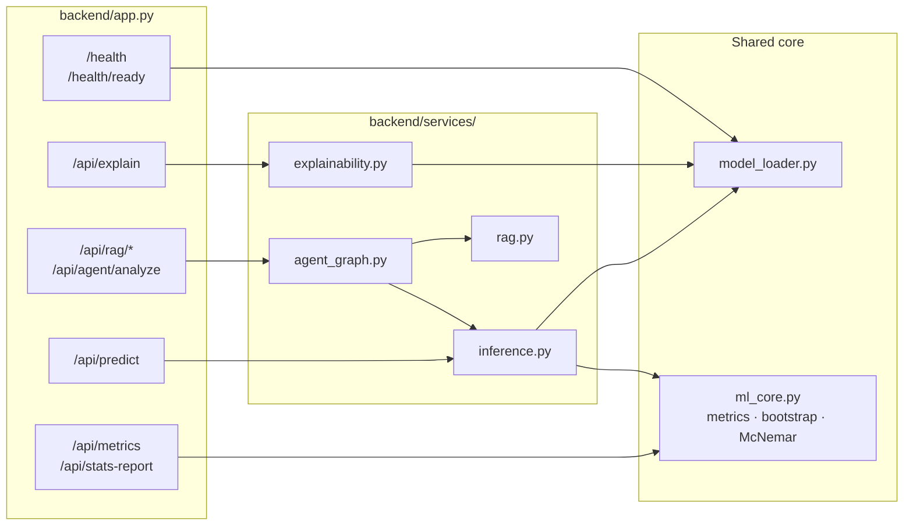
```mermaid
flowchart LR
    subgraph HTTP["backend/app.py"]
        P["/api/predict"]
        E["/api/explain"]
        S["/api/metrics<br/>/api/stats-report"]
        H["/health<br/>/health/ready"]
        R["/api/rag/*<br/>/api/agent/analyze"]
    end

    subgraph Svc["backend/services/"]
        Inf["inference.py"]
        XAI["explainability.py"]
        RAG["rag.py"]
        Ag["agent_graph.py"]
    end

    subgraph Core["Shared core"]
        Load["model_loader.py"]
        ML["ml_core.py<br/>metrics · bootstrap · McNemar"]
    end

    P --> Inf --> Load
    E --> XAI --> Load
    S --> ML
    H --> Load
    R --> Ag
    Ag --> Inf
    Ag --> RAG
    Inf --> ML
```

**Figure A.3.** Component view of the Flask process. All prediction paths converge on `model_loader` and `inference`. Statistical endpoints read `evaluation.json` through `ml_core`; missing artefacts yield HTTP 404/503 rather than placeholder numbers.

### 2.4 Training and evaluation pipeline

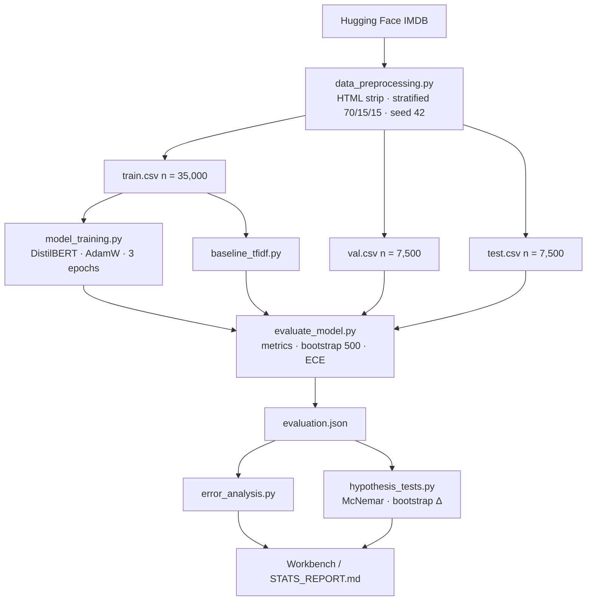
```mermaid
flowchart TB
    HF["Hugging Face IMDB"]
    PP["data_preprocessing.py<br/>HTML strip · stratified 70/15/15 · seed 42"]
    TR["train.csv  n = 35,000"]
    VA["val.csv    n = 7,500"]
    TE["test.csv   n = 7,500"]
    BASE["baseline_tfidf.py"]
    FIT["model_training.py<br/>DistilBERT · AdamW · 3 epochs"]
    EV["evaluate_model.py<br/>metrics · bootstrap 500 · ECE"]
    ER["error_analysis.py"]
    HY["hypothesis_tests.py<br/>McNemar · bootstrap Δ"]
    ART["evaluation.json"]
    WEB["Workbench / STATS_REPORT.md"]

    HF --> PP
    PP --> TR
    PP --> VA
    PP --> TE
    TR --> BASE
    TR --> FIT
    FIT --> EV
    BASE --> EV
    VA --> EV
    TE --> EV
    EV --> ART
    ART --> ER
    ART --> HY
    ER --> WEB
    HY --> WEB
```

**Figure A.4.** Offline academic pipeline (`make capstone`). Fitting uses the training split only. Validation supports monitoring and threshold exploration. **Test metrics are reported once** as primary evidence.

### 2.5 Online inference sequence


```mermaid
sequenceDiagram
    autonumber
    actor U as Client
    participant F as Flask :8000
    participant V as Validation + rate limit
    participant L as model_loader
    participant I as inference
    participant M as DistilBERT
    participant C as ml_core

    U->>F: POST /api/predict
    F->>V: length, CSRF origin, quota
    alt limited
        V-->>U: 429
    end
    F->>L: get_inference_bundle()
    alt no local weights, development
        L-->>L: HUB_MODEL_FALLBACK
    else production, not ready
        L-->>U: 503
    end
    F->>I: predict_sentiment() local HF
    I->>M: tokenize 256, softmax
    M-->>I: label, P(Fresh)
    I->>C: format JSON
    C-->>U: label, sentiment, confidence
```

**Figure A.5.** Inference sequence on the **Flask product path**. The decision rule is \(\hat{y} = \mathbb{1}[P(\text{Fresh}) \ge 0.5]\). Confidence is \(\max(P, 1-P)\). Truncation length is identical in training, evaluation, and serving. FastAPI and LangGraph instead call `predict_with_backend()` (Figure M.5).

### 2.6 Explainability and optional extensions

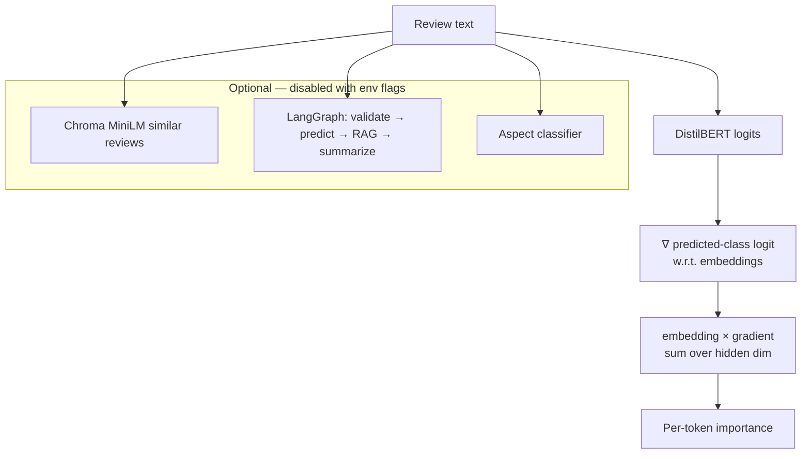
```mermaid
flowchart TB
    X["Review text"]
    Logits["DistilBERT logits"]
    Grad["∇ predicted-class logit<br/>w.r.t. embeddings"]
    IxG["embedding × gradient<br/>sum over hidden dim"]
    Tok["Per-token importance"]

    X --> Logits --> Grad --> IxG --> Tok

    subgraph Opt["Optional — disabled with env flags"]
        RAG["Chroma MiniLM similar reviews"]
        Agent["LangGraph: validate → predict → RAG → summarize"]
        Asp["Aspect classifier"]
    end

    X --> RAG
    X --> Agent
    X --> Asp
```

**Figure A.6.** Input × gradient attribution (`/api/explain`) is model-derived. The UI lexicon heatmap is a **separate heuristic** and must not be cited as model attribution. RAG and the agent graph are optional (`RAG_ENABLED`, `AGENT_ENABLED`).

### 2.7 Deployment topology

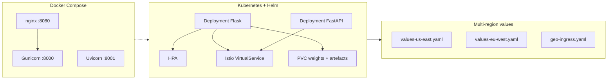
```mermaid
flowchart LR
    subgraph Compose["Docker Compose"]
        N["nginx :8080"]
        B["Gunicorn :8000"]
        A["Uvicorn :8001"]
        N --> B
    end

    subgraph Cluster["Kubernetes + Helm"]
        D1["Deployment Flask"]
        D2["Deployment FastAPI"]
        HPA["HPA"]
        VS["Istio VirtualService"]
        PVC["PVC weights + artefacts"]
        D1 --> HPA
        D1 --> VS
        D2 --> VS
        D1 --> PVC
    end

    subgraph Regions["Multi-region values"]
        US["values-us-east.yaml"]
        EU["values-eu-west.yaml"]
        GEO["geo-ingress.yaml"]
    end

    Compose -.-> Cluster --> Regions
```

**Figure A.7.** Delivery grades: Compose for demonstration; Helm for production-style serving; optional multi-region overlays with Istio mTLS. Readiness probes target `/health/ready`.

### 2.8 Continuous integration

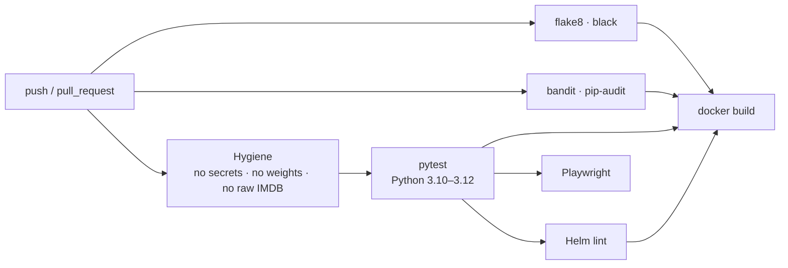
```mermaid
flowchart LR
    PR["push / pull_request"]
    Hyg["Hygiene<br/>no secrets · no weights · no raw IMDB"]
    Lint["flake8 · black"]
    Sec["bandit · pip-audit"]
    Py["pytest<br/>Python 3.10–3.12"]
    K["Helm lint"]
    E2E["Playwright"]
    Img["docker build"]

    PR --> Hyg --> Py
    PR --> Lint
    PR --> Sec
    Py --> K
    Py --> E2E
    Lint --> Img
    Sec --> Img
    Py --> Img
    K --> Img
```

**Figure A.8.** GitHub Actions (`.github/workflows/ci-cd.yml`). CI uses `HUB_MODEL_FALLBACK` so weights are not required in the repository. Hygiene fails the build if `data/raw/*.csv` or `*.safetensors` are tracked.

Layer-to-path mapping, health semantics, security controls, and architecture decision records: [docs/ARCHITECTURE.md](docs/ARCHITECTURE.md). OpenAPI: [docs/openapi.yaml](docs/openapi.yaml) · `/api/docs`.

---

## 3. AI and ML architecture

Section 2 is the **software** architecture (C4). This section is the **machine-learning** architecture: model family, neural encoder, inference routing, retrieval, agent orchestration, explainability, and experiment tracking. Figure numbers **M.1–M.12** match [docs/ARCHITECTURE.md](docs/ARCHITECTURE.md) Part B. CS diagram types used: use-case, layered, neural-block, class/module, activity, sequence, state, and data-flow.

These diagrams describe **code that exists in this repository**. Optional surfaces are labelled as such. Retrieval is **not** fused into DistilBERT logits. LoRA and the LLM baseline are **offline comparators**, not the serving checkpoint.

### 3.1 Use cases — AI functions examiners can invoke


```mermaid
flowchart TB
    subgraph Actors["Actors"]
        U["End user"]
        A["Analyst"]
        D["Developer"]
    end

    subgraph Core["Core ML — always on the product path"]
        UC1["Classify review<br/>POST /api/predict"]
        UC2["Batch CSV / SSE stream"]
        UC3["Explain tokens<br/>POST /api/explain"]
        UC4["Inspect test metrics / CIs"]
    end

    subgraph Product["Product ML — same DistilBERT"]
        UC5["Tone arc per sentence"]
        UC6["Aspect polarity<br/>acting plot visuals …"]
        UC7["Live draft preview"]
        UC8["A/B compare + attribution"]
        UC9["Voice to text then classify"]
    end

    subgraph Optional["Optional — env flags"]
        UC10["RAG similar reviews"]
        UC11["LangGraph agent"]
        UC12["Non-English via XLM-R"]
        UC13["Feast text features"]
        UC14["Remote vLLM / Triton"]
    end

    subgraph Offline["Offline science — Makefile"]
        UC15["Fine-tune DistilBERT"]
        UC16["TF-IDF / LoRA / LLM baselines"]
        UC17["McNemar · bootstrap · ablation"]
    end

    U --> UC1
    U --> UC2
    U --> UC3
    U --> UC5
    U --> UC6
    U --> UC7
    U --> UC8
    U --> UC9
    U --> UC10
    U --> UC11
    A --> UC4
    A --> UC15
    A --> UC16
    A --> UC17
    D --> UC12
    D --> UC13
    D --> UC14
```

**Figure M.1.** UML-style use-case map of every AI-facing function. Core classification, explanation, and statistics are first-class. RAG, the agent, multilingual routing, Feast, and remote backends are optional. LoRA / GPT-4o-mini baselines never sit on the live `/api/predict` path.

### 3.2 Layered ML architecture

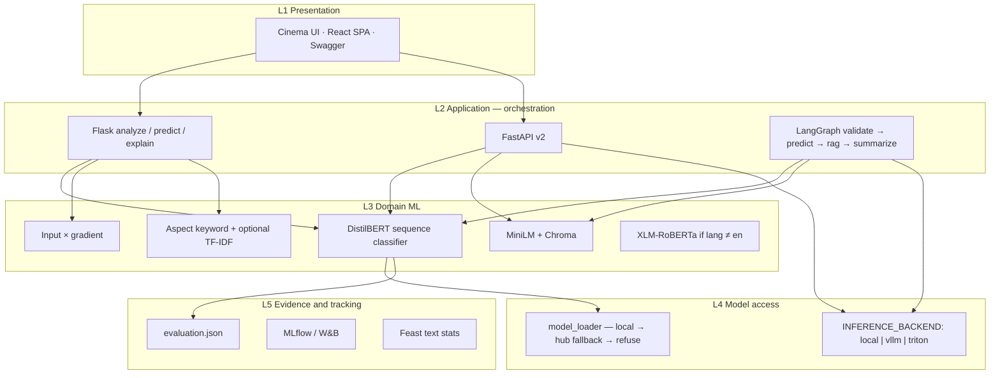
```mermaid
flowchart TB
    subgraph L1["L1 Presentation"]
        UI["Cinema UI · React SPA · Swagger"]
    end

    subgraph L2["L2 Application — orchestration"]
        Flask["Flask analyze / predict / explain"]
        Fast["FastAPI v2"]
        Agent["LangGraph validate → predict → rag → summarize"]
    end

    subgraph L3["L3 Domain ML"]
        Cls["DistilBERT sequence classifier"]
        XAI["Input × gradient"]
        Asp["Aspect keyword + optional TF-IDF"]
        Rag["MiniLM + Chroma"]
        Multi["XLM-RoBERTa if lang ≠ en"]
    end

    subgraph L4["L4 Model access"]
        Loader["model_loader — local → hub fallback → refuse"]
        Remote["INFERENCE_BACKEND: local | vllm | triton"]
    end

    subgraph L5["L5 Evidence and tracking"]
        Eval["evaluation.json"]
        MLflow["MLflow / W&B"]
        Feast["Feast text stats"]
    end

    UI --> Flask
    UI --> Fast
    Flask --> Cls
    Flask --> XAI
    Flask --> Asp
    Fast --> Cls
    Fast --> Rag
    Agent --> Cls
    Agent --> Rag
    Cls --> Loader
    Fast --> Remote
    Agent --> Remote
    Cls --> Eval
```

**Figure M.2.** Five-layer ML stack. L3 is the intelligence; L4 is how weights are resolved; L5 is evidence, not a second classifier. **Wiring caveat:** `INFERENCE_BACKEND` is honoured by FastAPI and LangGraph. Flask `POST /api/predict` and `POST /api/analyze` use local DistilBERT (`predict_sentiment`) plus optional multilingual routing.

### 3.3 DistilBERT neural architecture

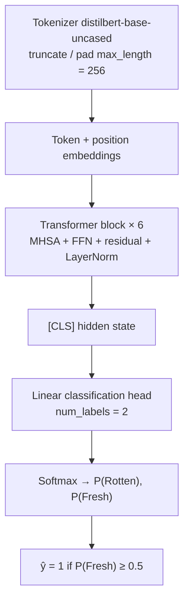
```mermaid
flowchart TB
    Tok["Tokenizer distilbert-base-uncased<br/>truncate / pad max_length = 256"]
    Emb["Token + position embeddings"]
    T1["Transformer block × 6<br/>MHSA + FFN + residual + LayerNorm"]
    Pool["[CLS] hidden state"]
    Head["Linear classification head<br/>num_labels = 2"]
    Soft["Softmax → P(Rotten), P(Fresh)"]
    Dec["ŷ = 1 if P(Fresh) ≥ 0.5"]

    Tok --> Emb --> T1 --> Pool --> Head --> Soft --> Dec
```

**Figure M.3.** Serving network: DistilBERT-base encoder (6 Transformer blocks) plus a 2-way head. Loss at train time is cross-entropy. Optimizer AdamW, lr \(2\times10^{-5}\), weight decay 0.01, 3 epochs, batch 16, best checkpoint by **F1** on validation. Sequence length is shared by train, evaluate, and serve (`MAX_SEQUENCE_LENGTH`).

### 3.4 Model family — what is trained vs what is served

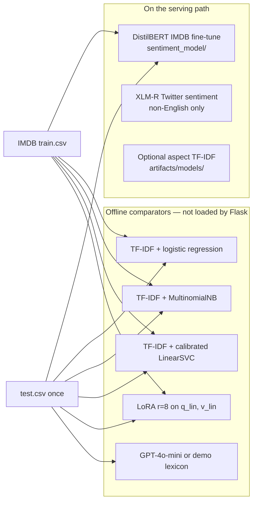
```mermaid
flowchart LR
    subgraph Served["On the serving path"]
        D["DistilBERT IMDB fine-tune<br/>sentiment_model/"]
        X["XLM-R Twitter sentiment<br/>non-English only"]
        AspM["Optional aspect TF-IDF<br/>artifacts/models/"]
    end

    subgraph Offline["Offline comparators — not loaded by Flask"]
        LR["TF-IDF + logistic regression"]
        NB["TF-IDF + MultinomialNB"]
        SVM["TF-IDF + calibrated LinearSVC"]
        LoRA["LoRA r=8 on q_lin, v_lin"]
        LLM["GPT-4o-mini or demo lexicon"]
    end

    IMDB["IMDB train.csv"] --> D
    IMDB --> LR
    IMDB --> NB
    IMDB --> SVM
    IMDB --> LoRA
    Test["test.csv once"] --> D
    Test --> LR
    Test --> NB
    Test --> SVM
    Test --> LoRA
    Test --> LLM
```

**Figure M.4.** Model family. The academic story is DistilBERT vs TF-IDF+LR on the same test split. LoRA (`make lora-quick`) and the LLM baseline (`make llm-baseline`) write comparison JSON; they do **not** replace `sentiment_model/` at inference.

### 3.5 Inference routing — language and backend

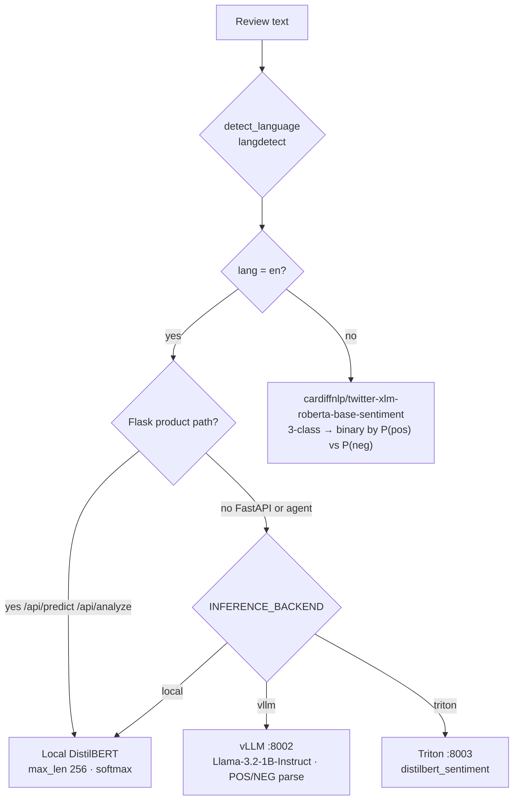
```mermaid
flowchart TD
    In["Review text"]
    Lang{"detect_language<br/>langdetect"}
    En{"lang = en?"}
    FlaskPath{"Flask product path?"}
    Backend{"INFERENCE_BACKEND"}

    Distil["Local DistilBERT<br/>max_len 256 · softmax"]
    XLMR["cardiffnlp/twitter-xlm-roberta-base-sentiment<br/>3-class → binary by P(pos) vs P(neg)"]
    VLLM["vLLM :8002<br/>Llama-3.2-1B-Instruct · POS/NEG parse"]
    Trit["Triton :8003<br/>distilbert_sentiment"]

    In --> Lang --> En
    En -->|yes| FlaskPath
    En -->|no| XLMR
    FlaskPath -->|yes /api/predict /api/analyze| Distil
    FlaskPath -->|no FastAPI or agent| Backend
    Backend -->|local| Distil
    Backend -->|vllm| VLLM
    Backend -->|triton| Trit
```

**Figure M.5.** Activity diagram of inference routing. English product traffic stays on the IMDB DistilBERT. Non-English may load XLM-R (`HUB_MODEL_MULTILINGUAL`; empty string disables). Remote backends are Compose profiles, not the default. The Triton repository currently ships a **lexicon Python backend** for smoke tests, not exported DistilBERT weights.

### 3.6 Composite analyse pipeline

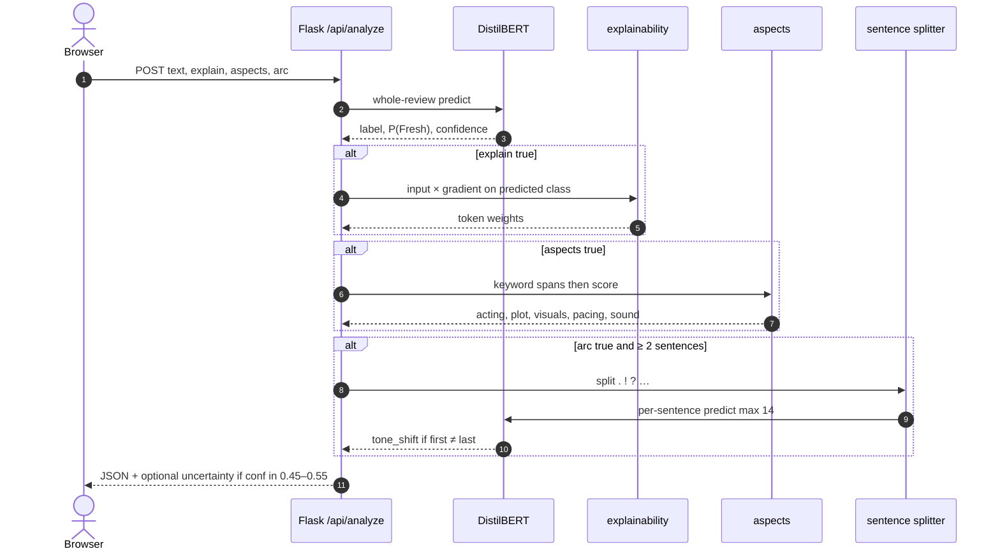
```mermaid
sequenceDiagram
    autonumber
    actor U as Browser
    participant F as Flask /api/analyze
    participant I as DistilBERT
    participant X as explainability
    participant A as aspects
    participant S as sentence splitter

    U->>F: POST text, explain, aspects, arc
    F->>I: whole-review predict
    I-->>F: label, P(Fresh), confidence
    alt explain true
        F->>X: input × gradient on predicted class
        X-->>F: token weights
    end
    alt aspects true
        F->>A: keyword spans then score
        A-->>F: acting, plot, visuals, pacing, sound
    end
    alt arc true and ≥ 2 sentences
        F->>S: split . ! ? …
        S->>I: per-sentence predict max 14
        I-->>F: tone_shift if first ≠ last
    end
    F-->>U: JSON + optional uncertainty if conf in 0.45–0.55
```

**Figure M.6.** Sequence for the rich analyse path. One encoder, four views: document label, token attribution, aspect polarity, sentence tone arc. Live draft (`live-preview.js`, 750 ms debounce) calls `/api/predict` only.

### 3.7 Retrieval-augmented generation (RAG)

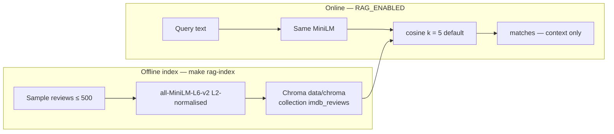
```mermaid
flowchart LR
    subgraph Index["Offline index — make rag-index"]
        CSV["Sample reviews ≤ 500"]
        EmbI["all-MiniLM-L6-v2 L2-normalised"]
        Chroma["Chroma data/chroma<br/>collection imdb_reviews"]
        CSV --> EmbI --> Chroma
    end

    subgraph Query["Online — RAG_ENABLED"]
        Q["Query text"]
        EmbQ["Same MiniLM"]
        KNN["cosine k = 5 default"]
        Out["matches — context only"]
        Q --> EmbQ --> KNN --> Out
        Chroma --> KNN
    end
```

**Figure M.7.** RAG is retrieve-and-display, **not** retrieval-augmented *classification*. Neighbours are returned beside the DistilBERT verdict; they do not enter the classification head. Disable: `RAG_ENABLED=false`. Empty index tells the client to run `make rag-index`.

### 3.8 LangGraph agent

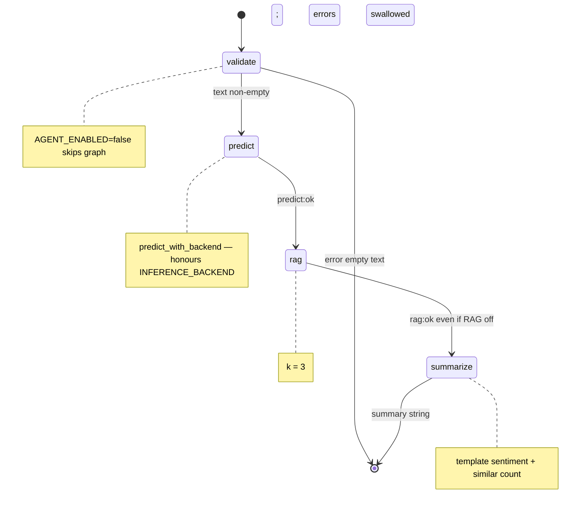
```mermaid
stateDiagram-v2
    [*] --> validate
    validate --> predict: text non-empty
    validate --> [*]: error empty text
    predict --> rag: predict:ok
    rag --> summarize: rag:ok even if RAG off
    summarize --> [*]: summary string

    note right of validate: AGENT_ENABLED=false skips graph
    note right of predict: predict_with_backend — honours INFERENCE_BACKEND
    note right of rag: k = 3; errors swallowed
    note right of summarize: template sentiment + similar count
```

**Figure M.8.** Agent state machine (`backend/services/agent_graph.py`). The graph is **linear** (no conditional tools, no planner loop): `validate → predict → rag → summarize → END`. Routes: `POST /api/agent/analyze`, `POST /api/v2/agent/analyze`.

### 3.9 Aspect sentiment and tone arc

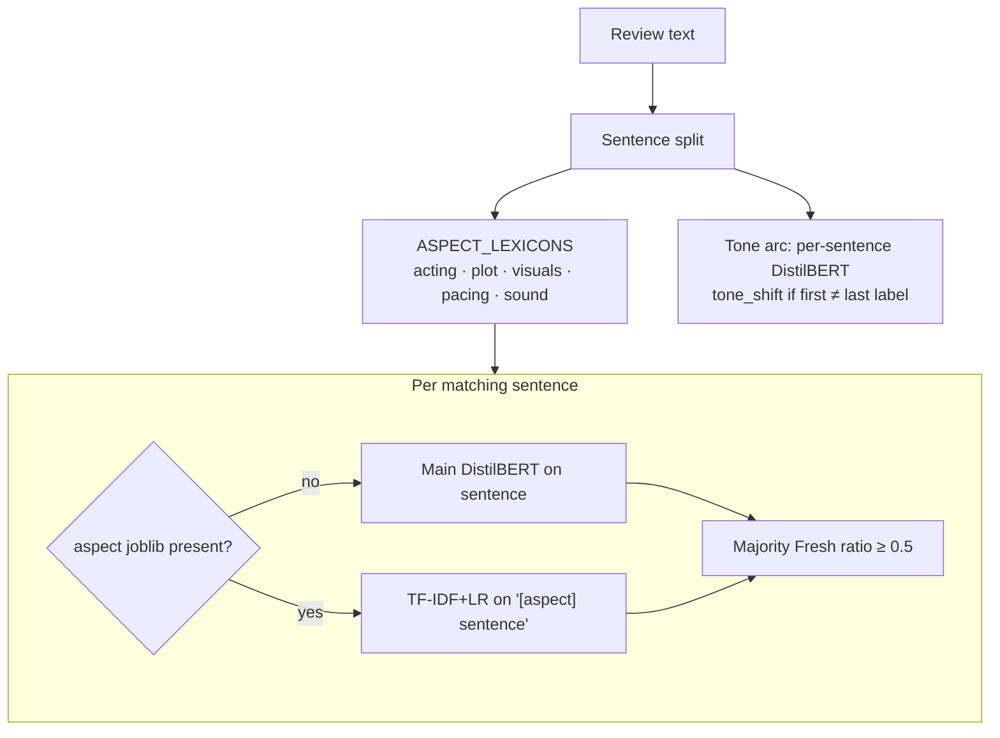
```mermaid
flowchart TB
    Rev["Review text"]
    Split["Sentence split"]
    Key["ASPECT_LEXICONS<br/>acting · plot · visuals · pacing · sound"]

    Rev --> Split --> Key

    subgraph PerAspect["Per matching sentence"]
        ML{"aspect joblib present?"}
        DistilA["Main DistilBERT on sentence"]
        TfidfA["TF-IDF+LR on '[aspect] sentence'"]
        Vote["Majority Fresh ratio ≥ 0.5"]
        ML -->|no| DistilA --> Vote
        ML -->|yes| TfidfA --> Vote
    end

    Key --> PerAspect
    Arc["Tone arc: per-sentence DistilBERT<br/>tone_shift if first ≠ last label"]
    Split --> Arc
```

**Figure M.9.** Aspects are **not** a second DistilBERT head. Keywords select spans; polarity comes from the main classifier or a small TF-IDF model (`make aspect-train`). Tone arc is independent: up to 14 sentence-level predictions.

### 3.10 Explainability data flow

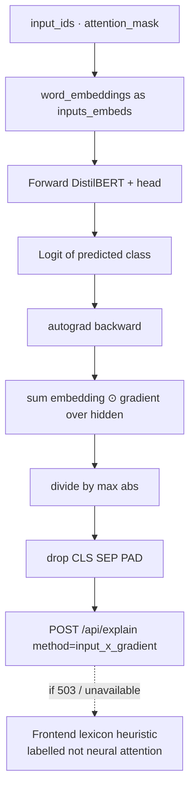
```mermaid
flowchart TB
    T["input_ids · attention_mask"]
    E["word_embeddings as inputs_embeds"]
    FWD["Forward DistilBERT + head"]
    Y["Logit of predicted class"]
    BWD["autograd backward"]
    IxG["sum embedding ⊙ gradient over hidden"]
    N["divide by max abs"]
    Drop["drop CLS SEP PAD"]
    API["POST /api/explain method=input_x_gradient"]

    T --> E --> FWD --> Y --> BWD --> IxG --> N --> Drop --> API

    FB["Frontend lexicon heuristic<br/>labelled not neural attention"]
    API -.->|if 503 / unavailable| FB
```

**Figure M.10.** Model-derived XAI is first-order input × gradient (Sundararajan-style saliency, not SHAP/IG). The cinema heatmap falls back to a POS/NEG lexicon and is labelled as such in the UI.

### 3.11 MLOps, features, and experiment tracking

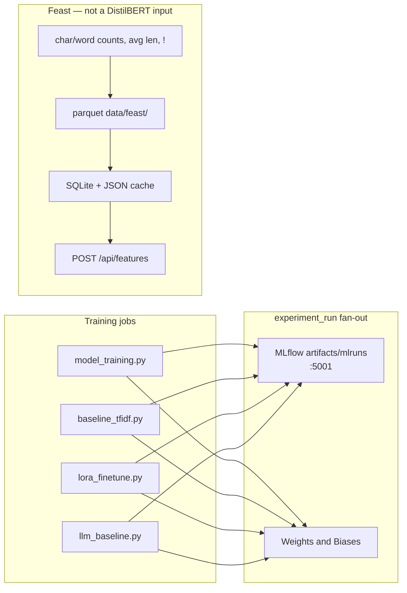
```mermaid
flowchart LR
    subgraph TrainJobs["Training jobs"]
        T1["model_training.py"]
        T2["baseline_tfidf.py"]
        T3["lora_finetune.py"]
        T4["llm_baseline.py"]
    end

    subgraph Track["experiment_run fan-out"]
        MF["MLflow artifacts/mlruns<br/>:5001"]
        WB["Weights and Biases"]
    end

    subgraph Feat["Feast — not a DistilBERT input"]
        Comp["char/word counts, avg len, !"]
        Off["parquet data/feast/"]
        On["SQLite + JSON cache"]
        API["POST /api/features"]
        Comp --> Off --> On --> API
    end

    T1 --> MF
    T2 --> MF
    T3 --> MF
    T4 --> MF
    T1 --> WB
    T2 --> WB
    T3 --> WB
    T4 --> WB
```

**Figure M.11.** MLflow experiments: `cinesentiment-distilbert`, `cinesentiment-baselines`, `cinesentiment-lora`, `cinesentiment-llm-baseline`. Kill switches: `MLFLOW_ENABLED`, `WANDB_ENABLED` / `WANDB_MODE=disabled`, `FEAST_ENABLED`. Feast stores surface text statistics for demos; DistilBERT still consumes raw tokens only.

### 3.12 Module diagram — ML code units

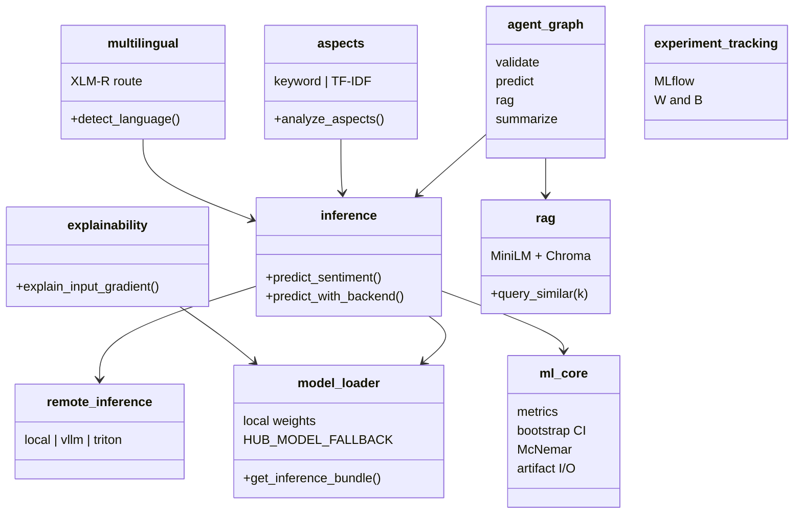
```mermaid
classDiagram
    class model_loader {
        +get_inference_bundle()
        local weights
        HUB_MODEL_FALLBACK
    }
    class inference {
        +predict_sentiment()
        +predict_with_backend()
    }
    class remote_inference {
        local | vllm | triton
    }
    class explainability {
        +explain_input_gradient()
    }
    class rag {
        +query_similar(k)
        MiniLM + Chroma
    }
    class agent_graph {
        validate
        predict
        rag
        summarize
    }
    class aspects {
        +analyze_aspects()
        keyword | TF-IDF
    }
    class multilingual {
        +detect_language()
        XLM-R route
    }
    class ml_core {
        metrics
        bootstrap CI
        McNemar
        artifact I/O
    }
    class experiment_tracking {
        MLflow
        W and B
    }

    inference --> model_loader
    inference --> remote_inference
    explainability --> model_loader
    agent_graph --> inference
    agent_graph --> rag
    aspects --> inference
    multilingual --> inference
    inference --> ml_core
```

**Figure M.12.** Static module view of `backend/`. Training scripts (`scripts/*.py`) write `sentiment_model/` and `evaluation.json`; they are not imported at request time except through those artefacts.

| Flag | Default | Effect |
|------|---------|--------|
| `RAG_ENABLED` | true | Chroma query surfaces |
| `AGENT_ENABLED` | true | LangGraph routes |
| `INFERENCE_BACKEND` | `local` | `vllm` / `triton` on FastAPI + agent only |
| `HUB_MODEL_MULTILINGUAL` | XLM-R id | Empty disables multilingual load |
| `MLFLOW_ENABLED` | true | Train-job logging |
| `FEAST_ENABLED` | true | Online feature lookup vs inline stats |
| `MAX_SEQUENCE_LENGTH` | 256 | Train = evaluate = serve |

Canonical write-up of Part B, including loader states and ADRs: [docs/ARCHITECTURE.md](docs/ARCHITECTURE.md).

---

## 4. Theoretical framework

Software architecture (**A.**) is wiring. ML architecture (**M.**) is which models run. This section is the **evaluation design**: empirical risk on train, selection on validation, a single test report, a nested linear baseline, and uncertainty via resampling. Detail: [docs/THEORY.md](docs/THEORY.md).

### 4.1 Knowledge architecture

```mermaid
flowchart TB
    subgraph Stats["Statistical learning"]
        IID["i.i.d. + held-out risk"]
        Split["Train / val / test isolation"]
        Boot["Percentile bootstrap"]
        Hyp["McNemar + Bonferroni"]
    end

    subgraph Rep["Representation"]
        Sparse["TF-IDF n-grams"]
        Ctx["Transformer contexts"]
        Dist["Knowledge distillation"]
    end

    subgraph Dec["Decision theory"]
        CE["Cross-entropy + softmax"]
        Thr["Threshold tau"]
        Cal["Brier / ECE"]
    end

    subgraph Art["Artefacts"]
        CSV["data/raw splits"]
        W["sentiment_model/"]
        EJ["evaluation.json"]
        API["/api/predict"]
        EX["/api/explain"]
    end

    IID --> Split --> CSV
    Sparse --> EJ
    Ctx --> Dist --> W
    Dist --> CE --> Thr --> API
    Boot --> EJ
    Hyp --> EJ
    Cal --> EJ
    W --> API
    W --> EX
```

**Figure T.1.** Method-to-artefact map. The protocol isolates train / val / test; DistilBERT and TF-IDF are two feature geometries; bootstrap and McNemar make a point estimate reportable.

### 4.2 Supervised problem and generalisation protocol

```mermaid
flowchart LR
    X["x review"] --> F["f_theta = P(y=1 | x)"]
    F --> G{"P >= tau"}
    G -->|yes| Pos["Fresh"]
    G -->|no| Neg["Rotten"]
    Y["y"] -.-> CE["CE loss on train only"]
    CE --> F
```

**Figure T.2.** Binary classification as \(P(y=1\mid x)\) plus a threshold. Default \(\tau = 0.5\) (balanced classes, equal costs).

```mermaid
flowchart TB
    D["IMDB 50k"] --> S["Stratify by y  seed 42"]
    S --> TR["Train 35k  fit theta"]
    S --> VA["Val 7.5k  select checkpoint"]
    S --> TE["Test 7.5k  report once"]
    TR --> Fit["DistilBERT + TF-IDF"]
    VA --> Sel["Best val F1"]
    Fit --> Sel
    Sel --> Once["Single evaluation on TE"]
    Once --> CI["Bootstrap 95% CI"]
    Once --> Mc["McNemar on paired errors"]
```

**Figure T.3.** Hold-out protocol. Validation selects the checkpoint; the test split is scored **once**.

### 4.3 Two representation families

```mermaid
flowchart TB
    X["Review"]

    subgraph Sparse["Sparse lexical  TF-IDF vector space"]
        Bow["n-grams"]
        Idf["TF-IDF  50k features  sublinear tf"]
        Phi["sparse phi(x)"]
        Bow --> Idf --> Phi
    end

    subgraph Dense["Dense contextual  Transformer"]
        Tok["WordPiece  len 256"]
        Att["Self-attention x 6"]
        H["h CLS"]
        Tok --> Att --> H
    end

    X --> Bow
    X --> Tok
    Phi --> Lin["Logistic / NB / SVM"]
    H --> Head["Linear 2-way head"]
```

**Figure T.4.** Two feature geometries on the same labels: bag-of-words vs contextual hidden states. The paired test asks whether **errors** differ, not whether Transformers “exist”.

```mermaid
flowchart LR
    TF["tf"] --> Sub["log(1+tf)"] --> IDF["idf"]
    IDF --> LR["Logistic GLM  primary baseline"]
    IDF --> NB["Multinomial NB  Laplace alpha=1"]
    IDF --> SVM["Linear SVM + calibration"]
```

**Figure T.5.** Linear models on TF-IDF features: logistic regression (primary baseline), naïve Bayes, margin SVM with calibrated probabilities.

### 4.4 Attention, distillation, transfer

```mermaid
flowchart TB
    Xin["X tokens x d"]
    Q["Q = X W_Q"]
    K["K = X W_K"]
    V["V = X W_V"]
    A["softmax(Q K^T / sqrt d_k)"]
    O["A V + residual + FFN"]
    Xin --> Q
    Xin --> K
    Xin --> V
    Q --> A
    K --> A
    A --> O
    V --> O
    O --> Six["6 DistilBERT blocks"] --> CLS["CLS then linear head"]
```

**Figure T.6.** Scaled dot-product attention as implemented by DistilBERT. Truncation at 256 tokens is ablated in `scripts/ablation_study.py`.

```mermaid
flowchart LR
    Pre["BooksCorpus + Wikipedia"] --> BERT["BERT-base teacher"]
    BERT -->|"distil student 6 layers"| Distil["DistilBERT"]
    Distil --> FT["Fine-tune on IMDB train"]
    FT --> W["sentiment_model/"]
```

**Figure T.7.** Transfer learning: start from a compressed BERT-family encoder, fine-tune on IMDB **train** only. This repo does not pre-train BERT.

### 4.5 Empirical risk and operating point

```mermaid
flowchart TB
    R["R_emp = mean CE(y, softmax z)"]
    O["AdamW  2e-5  wd 0.01  warmup"]
    V["Select theta* by val F1"]
    R --> O --> V
```

**Figure T.8.** Empirical risk = mean cross-entropy; AdamW trainer; **never** select on test F1.

```mermaid
flowchart LR
    P["P(Fresh)"] --> T["tau = 0.5 frozen for tables"]
    T --> Y["y-hat"]
    UI["Val slider / Insights sweep"] -.-> T
```

**Figure T.9.** Operating point \(\tau=0.5\) when classes are balanced and misclassification costs are equal. The UI slider is validation-side; the report freezes \(\tau=0.5\).

### 4.6 Evaluation, uncertainty, tests

```mermaid
flowchart TB
    subgraph Disc["Discrimination"]
        Acc["Accuracy"]
        F1["F1"]
        CM["TPR TNR PPV NPV"]
    end
    subgraph Rank["Ranking"]
        ROC["ROC-AUC"]
        AP["Average precision"]
    end
    subgraph Cal["Calibration"]
        Br["Brier"]
        ECE["ECE 10 bins"]
    end
    Pred["frozen split  y-hat and P"] --> Disc
    Pred --> Rank
    Pred --> Cal
```

**Figure T.10.** Three evaluation questions: are labels right, are scores ranked, are probabilities honest. Lead with test F1 and ROC-AUC.

```mermaid
flowchart LR
    TE["test n=7500"] --> B["resample B=500"] --> Q["2.5 / 97.5 percentiles"] --> CI["95% CI"]
```

**Figure T.11.** Percentile bootstrap CI in `ml_core.py`. This is sampling variability of the **test estimator**, not a Bayesian posterior.

```mermaid
flowchart TB
    Same["Same 7500 reviews"]
    D["DistilBERT"]
    L["TF-IDF+LR"]
    Same --> D
    Same --> L
    D --> Mc["McNemar  b,c  chi-square"]
    L --> Mc
    D --> Del["Bootstrap Delta acc / F1"]
    L --> Del
    Mc --> Out["p ~ 0.15  H0 not rejected"]
    Del --> Out
    Out --> Hon["Report a tie  ship DistilBERT for transfer / XAI"]
```

**Figure T.12.** Paired comparison of two classifiers on the **same** 7,500 rows: McNemar on errors, bootstrap \(\Delta\) on metrics. Result: **tie** at 5%. DistilBERT is still the serving model (transfer + saliency).

### 4.7 Further theory diagrams

| Figure | Theory | Where |
|--------|--------|--------|
| **T.13** | Calibration (Brier, ECE, reliability) | [docs/THEORY.md](docs/THEORY.md) |
| **T.14** | Attribution: input × gradient vs SHAP/IG | [docs/THEORY.md](docs/THEORY.md) |
| **T.15** | LoRA low-rank adapters (offline) | [docs/THEORY.md](docs/THEORY.md) |
| **T.16** | Dense retrieval / RAG **not fused** into logits | [docs/THEORY.md](docs/THEORY.md) |

Method → file: [docs/THEORY.md](docs/THEORY.md) §T.0.

---

## 5. Experimental protocol

| Item | Specification |
|------|----------------|
| Source | IMDB via `datasets.load_dataset("imdb")` |
| Pre-processing | HTML tag removal; no class re-weighting (source is 50/50) |
| Split | 70% train / 15% validation / 15% test, stratified by label, `random_state=42` |
| Sizes | 35,000 / 7,500 / 7,500 |
| Primary model | `distilbert-base-uncased` + 2-way classification head, cross-entropy, AdamW, linear warmup, `max_length=256`, default 3 epochs, lr \(2 \times 10^{-5}\) |
| Decision rule | Predict Fresh if \(P(y=1) \ge \tau\), \(\tau = 0.5\) unless swept |
| Baselines | TF-IDF + logistic regression (primary comparator); also multinomial naïve Bayes and calibrated Linear SVM |
| Uncertainty | Percentile bootstrap, 500 resamples, seed 42, 95% CI |
| Hypothesis tests | Continuity-corrected McNemar; bootstrap Δ accuracy/F1; Bonferroni when multiple baselines |
| Calibration | Reliability diagram (10 bins), Brier score, ECE |

Training never reads the test split. Validation may be used for early stopping and threshold exploration. **Test metrics are the only numbers cited as primary evidence.** Full protocol: [docs/METHODOLOGY.md](docs/METHODOLOGY.md).

---

## 6. Results

Authoritative numbers are regenerated from `artifacts/results/evaluation.json` (`make evaluate` / `make sync-docs`). The table below is the **test split** at \(\tau = 0.5\).

| Metric | DistilBERT | 95% CI (bootstrap) |
|--------|------------|---------------------|
| Accuracy | 91.76% | 91.11% – 92.31% |
| F1 | 91.80% | 91.14% – 92.41% |
| Precision (PPV) | 91.41% | 90.50% – 92.27% |
| Recall (TPR) | 92.19% | 91.27% – 93.02% |
| ROC-AUC | 97.35% | ranking metric; see Insights |
| Average precision | 97.22% | see PR curve |

**Confusion matrix (test, *n* = 7,500).** TN = 3,425 · FP = 325 · FN = 293 · TP = 3,457. Specificity 91.33%; balanced accuracy 91.76%; error rate 8.24%.

**Baseline (TF-IDF + logistic regression, same test split).** Accuracy 91.24%; F1 91.33%; ΔF1 (DistilBERT − baseline) = +0.47 percentage points.

**Hypothesis tests (test, α = 0.05).** McNemar: *b* = 366, *c* = 327, *p* = 0.1489 (**not significant**). Bootstrap Δ accuracy +0.0050 [−0.0010, 0.0120], *p* = 0.1333; ΔF1 +0.0044 [−0.0021, 0.0102], *p* = 0.2267. Intervals include zero. Interpretation: the models are statistically tied on this split; DistilBERT is the serving model for product and research flexibility ([docs/DEFENSE_SLIDE_LIMITATIONS.md](docs/DEFENSE_SLIDE_LIMITATIONS.md)).

Validation accuracy 91.96% (CI 91.33%–92.61%) is consistent with test, indicating limited validation overfitting.

---

## 7. Reproducibility contract

From a clean clone:

```bash
git clone https://github.com/TheHien04/Movie-Review-Sentiment-Analysis.git
cd Movie-Review-Sentiment-Analysis
make install
make preprocess    # downloads IMDB → data/raw/ (not stored in git)
make capstone      # baseline → train → evaluate → hypothesis tests → pytest
make serve         # http://127.0.0.1:8000
```

| Command | Output |
|---------|--------|
| `make preprocess` | Stratified IMDB splits in `data/raw/` (local only, ~65 MB) |
| `make capstone` | Full academic pipeline; writes `artifacts/results/capstone_run_log.json` |
| `make evaluate` | Refreshes `artifacts/results/evaluation.json` |
| `make test` | pytest suite (`tests/`) |
| `make github-check` | Hygiene script + tests — run before `git push` ([docs/GITHUB.md](docs/GITHUB.md)) |
| `make serve-prod` | Gunicorn production WSGI |
| `make serve-fastapi` | FastAPI v2 on :8001 |
| `make notebooks` | Executes notebooks → `artifacts/results/*.html` |

Seeds: NumPy, scikit-learn, PyTorch, and Hugging Face Trainer use `seed=42`. Dependency pins: `requirements-lock.txt` (`make lock-deps`).

**Development without local weights.** If `sentiment_model/` has no `model.safetensors` / `pytorch_model.bin`, `make serve` sets `HUB_MODEL_FALLBACK` so the UI remains demonstrable. Production must ship fine-tuned weights or an explicit fallback.

---

## 8. User interface

Captions map to [docs/FIGURES.md](docs/FIGURES.md) for thesis-style citation. Dashboard figures may show the **validation** split; cite **test** numbers from Section 6 / `STATS_REPORT.md`.

### Product surfaces

**Figure 1.** Landing page — problem statement and model performance summary (DistilBERT on IMDB).


**Figure 2.** Landing page — example outputs and workflow modules (single, batch, XAI, compare, API).


**Figure 3.** Single-review analysis — text input, live draft inference, Rottenmeter gauge.


**Figure 4.** Batch analysis — CSV upload, verdict table, export.


**Figure 5.** Voice input — speech-to-text before classification.


**Figure 6.** Side-by-side comparison — labels, confidence, token-level attribution (input × gradient).


**Figure 7.** Comparison charts — confidence bar/donut and natural-language summary.


### Model evaluation dashboard

**Figure 8.** Dataset overview — train / validation / test sizes (35k / 7.5k / 7.5k).


**Figure 9.** Model comparison — DistilBERT vs TF-IDF on the selected split with 95% bootstrap CIs; error-analysis panel.


**Figure 10.** Validation metrics and derived rates (sensitivity, specificity, PPV, NPV).


**Figure 11.** Confusion matrix, label distribution (50/50), multi-metric bar chart.


**Figures 12–14.** Detail modals — metrics with CIs, confusion matrix, label distribution.

| Metrics | Confusion matrix | Label distribution |
|---------|------------------|-------------------|
|  |  |  |

**Figure 15.** Summary and actions — decision threshold slider, PDF export, detail views.


**Figure 16.** Model transparency — links to stats report, insights curves, EDA; Analyse → Compare → Integrate workflow.


---

## 9. Application programming interface

| Method | Path | Description |
|--------|------|-------------|
| `GET` | `/health` | Liveness; model load status |
| `GET` | `/health/ready` | Readiness (inference available) |
| `POST` | `/api/predict` | Single text or batch CSV |
| `POST` | `/api/explain` | Input × gradient token importance |
| `GET` | `/api/metrics` | Metrics by split and threshold |
| `GET` | `/api/model-comparison` | DistilBERT vs baselines |
| `GET` | `/api/stats-report` | Printable statistics payload |
| `GET` | `/artifacts/results/evaluation.json` | Full evaluation artefact |

Extended v2 routes (FastAPI :8001), developer keys, webhooks, RAG, and the agent graph: [docs/openapi.yaml](docs/openapi.yaml).

---

## 10. Repository layout

| Path | Role |
|------|------|
| `backend/` | Flask app, FastAPI v2, inference, `ml_core`, services |
| `frontend/` | Static cinema workbench |
| `frontend-react/` | Optional React UI at `/modern/` |
| `scripts/` | Training, evaluation, baselines, hypothesis tests, ablation |
| `notebooks/` | EDA, error analysis, model comparison |
| `tests/` | Unit, integration, capstone, platform contracts |
| `e2e/` | Playwright browser tests |
| `deploy/` | Kubernetes, Helm, Istio, Triton model repository |
| `artifacts/results/` | Versioned evaluation artefacts |
| `docs/` | Methodology, theory, statistics, architecture, model card, figures |

Full tree: [PROJECT_STRUCTURE.md](PROJECT_STRUCTURE.md).

---

## 11. Quality assurance and continuous integration

```bash
make test              # pytest
make e2e-playwright    # browser E2E (optional)
make k8s-validate      # manifest YAML lint
make github-check      # hygiene + tests before push
```

GitHub Actions: hygiene (secrets, weights, raw data), lint (flake8, black), security (bandit, pip-audit), pytest on Python 3.10–3.12, Docker build, Kubernetes/Helm validation, Playwright E2E.

---

## 12. Deployment

| Target | Command |
|--------|---------|
| Local development | `make serve` |
| Production WSGI | `make serve-prod` |
| Docker Compose | `docker compose up` |
| Kubernetes / Helm | [deploy/README.md](deploy/README.md) |

Environment template: `.env.example`. Never commit `.env`. Operator notes: [docs/DEPLOYMENT.md](docs/DEPLOYMENT.md). Platform extensions (MLflow, RAG, Istio, multi-region): [docs/SILICON_VALLEY_STACK.md](docs/SILICON_VALLEY_STACK.md).

---

## 13. Limitations

1. **Domain.** Evaluation is IMDB-only; transfer to other review sources is not demonstrated.
2. **Label set.** Neutral and mixed sentiment are not modelled.
3. **Truncation.** Reviews longer than 256 tokens lose information (quantified in ablation).
4. **Statistical comparison.** DistilBERT and TF-IDF are tied at α = 0.05 on this test split; do not cite a significant accuracy win.
5. **Attribution.** Input × gradient is a first-order approximation; SHAP / integrated gradients are more rigorous but too expensive for the interactive API.
6. **Validation design.** A single stratified split (no *k*-fold) is used; transformer *k*-fold was judged computationally prohibitive.
7. **Ablation compute.** Hyper-parameter sweeps use a training subset (default 3,000 rows).
8. **Retrieval.** RAG neighbours are context for the UI/agent; they are not concatenated into DistilBERT.
9. **Remote inference.** `INFERENCE_BACKEND` does not apply to Flask `/api/predict`. Triton’s checked-in `model.py` is a lexicon smoke test.
10. **Agent.** LangGraph is a linear four-node graph, not a tool-calling planner.

---

## 14. Documentation index

| Document | Audience | Content |
|----------|----------|---------|
| [docs/ARCHITECTURE.md](docs/ARCHITECTURE.md) | Software / ML examiners | C4 (A.1–A.8) · AI/ML diagrams (M.1–M.15) · ADRs |
| [docs/THEORY.md](docs/THEORY.md) | Examiners | Hold-out protocol, metrics, paired tests |
| [docs/STATS_REPORT.md](docs/STATS_REPORT.md) | Statistics / DS | Test metrics, CIs, confusion matrix, baselines |
| [docs/METHODOLOGY.md](docs/METHODOLOGY.md) | Reviewers | Protocol, related work, ablation |
| [docs/MODEL_CARD.md](docs/MODEL_CARD.md) | ML governance | Intended use, limitations, metrics |
| [docs/FIGURES.md](docs/FIGURES.md) | Report writing | Per-screenshot academic captions |
| [docs/DEFENSE_SLIDE_LIMITATIONS.md](docs/DEFENSE_SLIDE_LIMITATIONS.md) | Oral defence | McNemar interpretation, model choice |
| [docs/SILICON_VALLEY_STACK.md](docs/SILICON_VALLEY_STACK.md) | Platform | MLflow, observability, K8s, RAG |
| [SECURITY.md](SECURITY.md) | Operators | Secrets, rate limits, reporting |
| [docs/GITHUB.md](docs/GITHUB.md) | Contributors | Branch policy, `make github-check` |

---

## 15. Citation

```bibtex
@misc{cinesentiment2026,
  author       = {The Hien},
  title        = {CineSentiment: IMDB Movie Review Sentiment Analysis with DistilBERT},
  year         = {2026},
  howpublished = {\url{https://github.com/TheHien04/Movie-Review-Sentiment-Analysis}},
  note         = {Statistical Machine Learning capstone; DistilBERT; bootstrap CIs}
}
```

Primary numbers: [docs/STATS_REPORT.md](docs/STATS_REPORT.md). Protocol: [docs/METHODOLOGY.md](docs/METHODOLOGY.md).

---

**Course context:** Statistical Machine Learning capstone  
**Architecture specification:** [docs/ARCHITECTURE.md](docs/ARCHITECTURE.md)  
**Theoretical framework:** [docs/THEORY.md](docs/THEORY.md)  
**Last updated:** September 2026
