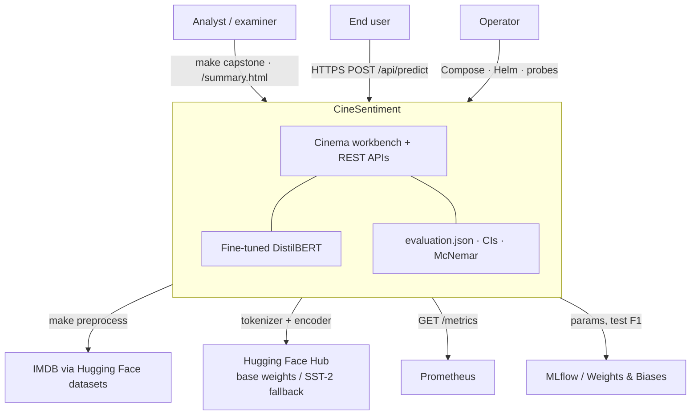
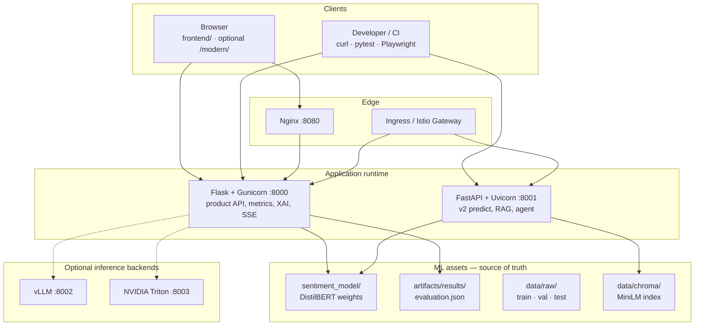
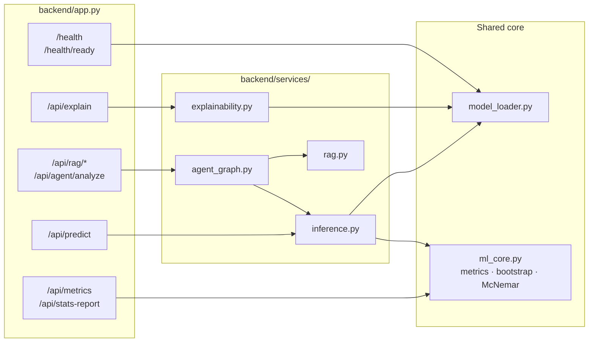
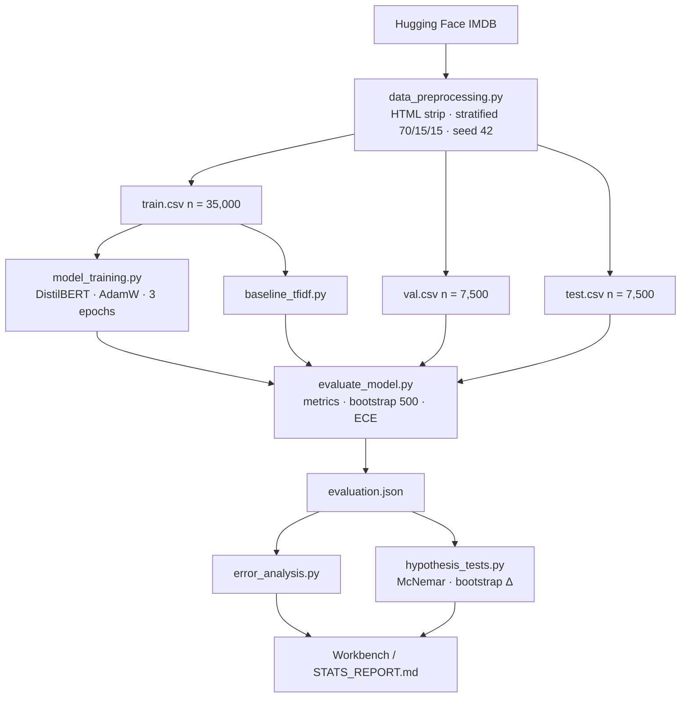
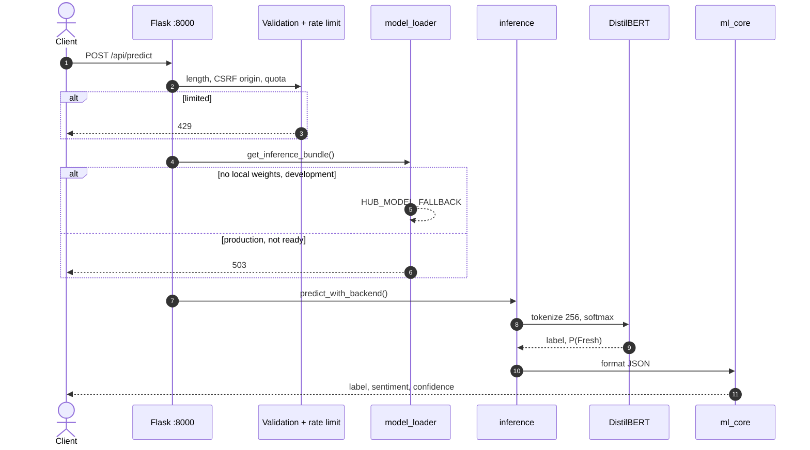
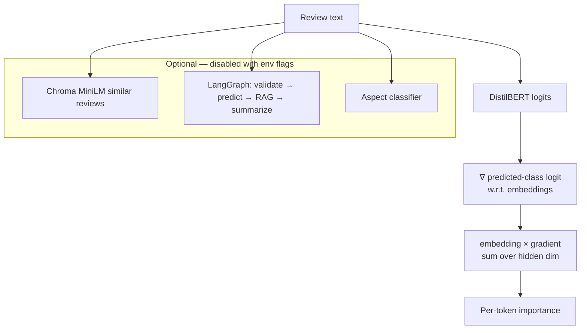
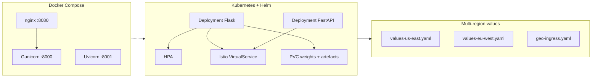
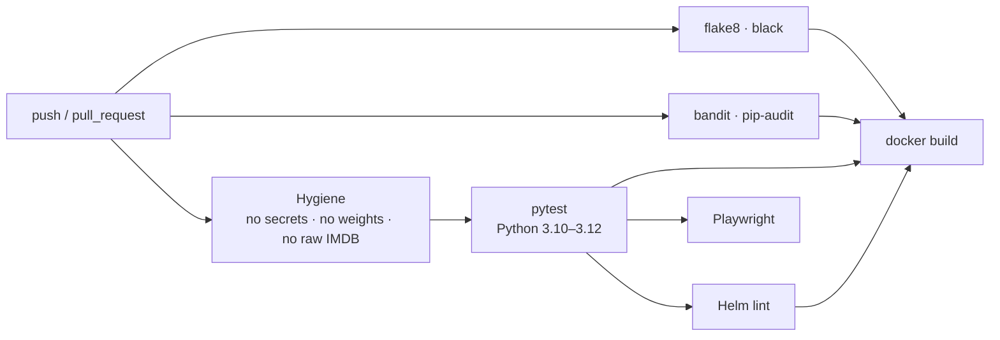

# CineSentiment: IMDB Movie Review Sentiment Analysis

### A reproducible DistilBERT pipeline with statistical evaluation and a production-style serving stack

[](https://github.com/TheHien04/Movie-Review-Sentiment-Analysis/actions/workflows/ci-cd.yml)
[](LICENSE)
[](https://www.python.org/)
[](VERSION)

| | |
|---|---|
| **System** | CineSentiment |
| **Task** | Binary sentiment classification (Fresh / Rotten) |
| **Primary model** | Fine-tuned DistilBERT (`distilbert-base-uncased`) |
| **Dataset** | IMDB 50,000 labelled English movie reviews (Maas et al., 2011) |
| **Held-out test** | *n* = 7,500 · accuracy 91.76% · F1 91.80% · ROC-AUC 97.35% |
| **Uncertainty** | Percentile bootstrap 95% CI, 500 resamples, seed 42 |
| **Version** | 2.3.0 |
| **Licence** | MIT |

**Abstract.** This repository presents an end-to-end system for binary sentiment classification of English movie reviews. A DistilBERT encoder is fine-tuned on a stratified 70/15/15 partition of IMDB, evaluated once on a held-out test split with bootstrap confidence intervals, and compared against a pre-registered TF-IDF + logistic regression baseline under McNemar and bootstrap-difference tests. The same checkpoint is served through a Flask product API and a parallel FastAPI v2 surface, with a cinema-themed workbench for single/batch inference, token-level attribution, and a metrics dashboard bound to versioned artefacts. The design follows a C4-inspired decomposition (context, container, component) and a Makefile-driven reproducibility contract. Primary statistical evidence is [docs/STATS_REPORT.md](docs/STATS_REPORT.md); the canonical architecture specification is [docs/ARCHITECTURE.md](docs/ARCHITECTURE.md).

**Keywords:** sentiment analysis; DistilBERT; IMDB; bootstrap confidence intervals; McNemar test; reproducible ML; REST API; explainable AI.

---

## Contents

1. [Research question and contributions](#1-research-question-and-contributions)
2. [System architecture](#2-system-architecture)
3. [Experimental protocol](#3-experimental-protocol)
4. [Results](#4-results)
5. [Reproducibility contract](#5-reproducibility-contract)
6. [User interface](#6-user-interface)
7. [Application programming interface](#7-application-programming-interface)
8. [Repository layout](#8-repository-layout)
9. [Quality assurance and continuous integration](#9-quality-assurance-and-continuous-integration)
10. [Deployment](#10-deployment)
11. [Limitations](#11-limitations)
12. [Documentation index](#12-documentation-index)
13. [Citation](#13-citation)

---

## 1. Research question and contributions

**Research question.** Does a fine-tuned DistilBERT classifier achieve *reportable* generalisation on a held-out IMDB test split (point estimates with bootstrap confidence intervals), and does it outperform a classical TF-IDF + logistic regression baseline under a fixed, stratified data protocol?

Paired error analysis (McNemar) and metric-difference tests are reported honestly: on this split the two models are **statistically tied** at α = 0.05. DistilBERT is retained as the serving model for transfer, calibration, and explainability—not because hypothesis tests proved dominance. See [docs/STATS_REPORT.md](docs/STATS_REPORT.md) and [docs/DEFENSE_SLIDE_LIMITATIONS.md](docs/DEFENSE_SLIDE_LIMITATIONS.md).

**Contributions.**

1. **Protocol.** Deterministic, stratified IMDB splits; train-only fitting; test metrics reported once.
2. **Evaluation.** Accuracy, F1, precision, recall, ROC-AUC, Brier, ECE, confusion-derived rates, and 95% bootstrap CIs.
3. **Comparison.** Nested TF-IDF baselines (logistic regression, naïve Bayes, calibrated Linear SVM) plus McNemar, bootstrap Δ, effect sizes, and Bonferroni correction.
4. **Serving architecture.** Dual HTTP surfaces, health/readiness probes, optional RAG/agent path, and Compose/Helm delivery.
5. **Workbench.** Cinema UI bound to `evaluation.json` so examiners inspect the same numbers as the written report.

---

## 2. System architecture

The architecture is specified at four levels, following the C4 model (Brown, 2018): **context**, **containers**, **components**, and **code-level sequences**. Figure numbers **A.1–A.8** match [docs/ARCHITECTURE.md](docs/ARCHITECTURE.md). UI screenshots remain Figures 1–16 ([docs/FIGURES.md](docs/FIGURES.md)).

### 2.1 Context — what the system is


```mermaid
flowchart TB
    Analyst["Analyst / examiner"]
    User["End user"]
    Operator["Operator"]

    subgraph Cine["CineSentiment"]
        direction TB
        Workbench["Cinema workbench + REST APIs"]
        Model["Fine-tuned DistilBERT"]
        Evidence["evaluation.json · CIs · McNemar"]
        Workbench --- Model
        Workbench --- Evidence
    end

    IMDB["IMDB via Hugging Face datasets"]
    Hub["Hugging Face Hub<br/>base weights / SST-2 fallback"]
    Prom["Prometheus"]
    Track["MLflow / Weights & Biases"]

    Analyst -->|make capstone · /summary.html| Cine
    User -->|HTTPS POST /api/predict| Cine
    Operator -->|Compose · Helm · probes| Cine
    Cine -->|make preprocess| IMDB
    Cine -->|tokenizer + encoder| Hub
    Cine -->|GET /metrics| Prom
    Cine -->|params, test F1| Track
```

**Figure A.1.** System context. CineSentiment is a single bounded context: movie-review sentiment as a service plus an evaluation workbench. Raw IMDB CSVs are regenerated locally and are not stored in git.

### 2.2 Containers — main runtime architecture

This is the **principal architecture diagram**: independently deployable processes and durable stores.


```mermaid
flowchart TB
    subgraph Clients["Clients"]
        Browser["Browser<br/>frontend/ · optional /modern/"]
        Dev["Developer / CI<br/>curl · pytest · Playwright"]
    end

    subgraph Edge["Edge"]
        Nginx["Nginx :8080"]
        Ingress["Ingress / Istio Gateway"]
    end

    subgraph Runtime["Application runtime"]
        Flask["Flask + Gunicorn :8000<br/>product API, metrics, XAI, SSE"]
        FastAPI["FastAPI + Uvicorn :8001<br/>v2 predict, RAG, agent"]
    end

    subgraph Optional["Optional inference backends"]
        vLLM["vLLM :8002"]
        Triton["NVIDIA Triton :8003"]
    end

    subgraph Assets["ML assets — source of truth"]
        Weights["sentiment_model/<br/>DistilBERT weights"]
        Eval["artifacts/results/<br/>evaluation.json"]
        Splits["data/raw/<br/>train · val · test"]
        Chroma["data/chroma/<br/>MiniLM index"]
    end

    Browser --> Nginx
    Browser --> Flask
    Dev --> Flask
    Dev --> FastAPI
    Nginx --> Flask
    Ingress --> Flask
    Ingress --> FastAPI
    Flask --> Weights
    Flask --> Eval
    FastAPI --> Weights
    FastAPI --> Chroma
    Flask -.-> vLLM
    Flask -.-> Triton
```

**Figure A.2.** Main container architecture. Flask (:8000) is the product and academic surface. FastAPI (:8001) is a typed v2 API. DistilBERT weights and `evaluation.json` are the two authoritative runtime artefacts. Remote backends (vLLM, Triton) are selected with `INFERENCE_BACKEND` and are off by default.

| Container | Technology | Responsibility |
|-----------|------------|----------------|
| Cinema UI | HTML5, Bootstrap 5, Chart.js | Analyse, compare, metrics, insights, developer portal |
| React SPA | Vite, React 18, TypeScript | Optional `/modern/` surface |
| Flask API | Flask 3, Gunicorn | Inference, explainability, statistics, webhooks |
| FastAPI v2 | FastAPI, Uvicorn | Async predict, RAG, LangGraph agent |
| DistilBERT | PyTorch, Transformers | Sequence classification, `max_length = 256` |
| Evaluation store | JSON / CSV | Test metrics, CIs, baselines, hypothesis tests |
| Chroma | `all-MiniLM-L6-v2` | Optional nearest-neighbour reviews |

### 2.3 Components — Flask backend


```mermaid
flowchart LR
    subgraph HTTP["backend/app.py"]
        P["/api/predict"]
        E["/api/explain"]
        S["/api/metrics<br/>/api/stats-report"]
        H["/health<br/>/health/ready"]
        R["/api/rag/*<br/>/api/agent/analyze"]
    end

    subgraph Svc["backend/services/"]
        Inf["inference.py"]
        XAI["explainability.py"]
        RAG["rag.py"]
        Ag["agent_graph.py"]
    end

    subgraph Core["Shared core"]
        Load["model_loader.py"]
        ML["ml_core.py<br/>metrics · bootstrap · McNemar"]
    end

    P --> Inf --> Load
    E --> XAI --> Load
    S --> ML
    H --> Load
    R --> Ag
    Ag --> Inf
    Ag --> RAG
    Inf --> ML
```

**Figure A.3.** Component view of the Flask process. All prediction paths converge on `model_loader` and `inference`. Statistical endpoints read `evaluation.json` through `ml_core`; missing artefacts yield HTTP 404/503 rather than placeholder numbers.

### 2.4 Training and evaluation pipeline


```mermaid
flowchart TB
    HF["Hugging Face IMDB"]
    PP["data_preprocessing.py<br/>HTML strip · stratified 70/15/15 · seed 42"]
    TR["train.csv  n = 35,000"]
    VA["val.csv    n = 7,500"]
    TE["test.csv   n = 7,500"]
    BASE["baseline_tfidf.py"]
    FIT["model_training.py<br/>DistilBERT · AdamW · 3 epochs"]
    EV["evaluate_model.py<br/>metrics · bootstrap 500 · ECE"]
    ER["error_analysis.py"]
    HY["hypothesis_tests.py<br/>McNemar · bootstrap Δ"]
    ART["evaluation.json"]
    WEB["Workbench / STATS_REPORT.md"]

    HF --> PP
    PP --> TR
    PP --> VA
    PP --> TE
    TR --> BASE
    TR --> FIT
    FIT --> EV
    BASE --> EV
    VA --> EV
    TE --> EV
    EV --> ART
    ART --> ER
    ART --> HY
    ER --> WEB
    HY --> WEB
```

**Figure A.4.** Offline academic pipeline (`make capstone`). Fitting uses the training split only. Validation supports monitoring and threshold exploration. **Test metrics are reported once** as primary evidence.

### 2.5 Online inference sequence


```mermaid
sequenceDiagram
    autonumber
    actor U as Client
    participant F as Flask :8000
    participant V as Validation + rate limit
    participant L as model_loader
    participant I as inference
    participant M as DistilBERT
    participant C as ml_core

    U->>F: POST /api/predict
    F->>V: length, CSRF origin, quota
    alt limited
        V-->>U: 429
    end
    F->>L: get_inference_bundle()
    alt no local weights, development
        L-->>L: HUB_MODEL_FALLBACK
    else production, not ready
        L-->>U: 503
    end
    F->>I: predict_with_backend()
    I->>M: tokenize 256, softmax
    M-->>I: label, P(Fresh)
    I->>C: format JSON
    C-->>U: label, sentiment, confidence
```

**Figure A.5.** Inference sequence. The decision rule is \(\hat{y} = \mathbb{1}[P(\text{Fresh}) \ge 0.5]\). Confidence is \(\max(P, 1-P)\). Truncation length is identical in training, evaluation, and serving.

### 2.6 Explainability and optional extensions


```mermaid
flowchart TB
    X["Review text"]
    Logits["DistilBERT logits"]
    Grad["∇ predicted-class logit<br/>w.r.t. embeddings"]
    IxG["embedding × gradient<br/>sum over hidden dim"]
    Tok["Per-token importance"]

    X --> Logits --> Grad --> IxG --> Tok

    subgraph Opt["Optional — disabled with env flags"]
        RAG["Chroma MiniLM similar reviews"]
        Agent["LangGraph: validate → predict → RAG → summarize"]
        Asp["Aspect classifier"]
    end

    X --> RAG
    X --> Agent
    X --> Asp
```

**Figure A.6.** Input × gradient attribution (`/api/explain`) is model-derived. The UI lexicon heatmap is a **separate heuristic** and must not be cited as model attribution. RAG and the agent graph are optional (`RAG_ENABLED`, `AGENT_ENABLED`).

### 2.7 Deployment topology


```mermaid
flowchart LR
    subgraph Compose["Docker Compose"]
        N["nginx :8080"]
        B["Gunicorn :8000"]
        A["Uvicorn :8001"]
        N --> B
    end

    subgraph Cluster["Kubernetes + Helm"]
        D1["Deployment Flask"]
        D2["Deployment FastAPI"]
        HPA["HPA"]
        VS["Istio VirtualService"]
        PVC["PVC weights + artefacts"]
        D1 --> HPA
        D1 --> VS
        D2 --> VS
        D1 --> PVC
    end

    subgraph Regions["Multi-region values"]
        US["values-us-east.yaml"]
        EU["values-eu-west.yaml"]
        GEO["geo-ingress.yaml"]
    end

    Compose -.-> Cluster --> Regions
```

**Figure A.7.** Delivery grades: Compose for demonstration; Helm for production-style serving; optional multi-region overlays with Istio mTLS. Readiness probes target `/health/ready`.

### 2.8 Continuous integration


```mermaid
flowchart LR
    PR["push / pull_request"]
    Hyg["Hygiene<br/>no secrets · no weights · no raw IMDB"]
    Lint["flake8 · black"]
    Sec["bandit · pip-audit"]
    Py["pytest<br/>Python 3.10–3.12"]
    K["Helm lint"]
    E2E["Playwright"]
    Img["docker build"]

    PR --> Hyg --> Py
    PR --> Lint
    PR --> Sec
    Py --> K
    Py --> E2E
    Lint --> Img
    Sec --> Img
    Py --> Img
    K --> Img
```

**Figure A.8.** GitHub Actions (`.github/workflows/ci-cd.yml`). CI uses `HUB_MODEL_FALLBACK` so weights are not required in the repository. Hygiene fails the build if `data/raw/*.csv` or `*.safetensors` are tracked.

Layer-to-path mapping, health semantics, security controls, and architecture decision records: [docs/ARCHITECTURE.md](docs/ARCHITECTURE.md). OpenAPI: [docs/openapi.yaml](docs/openapi.yaml) · `/api/docs`.

---

## 3. Experimental protocol

| Item | Specification |
|------|----------------|
| Source | IMDB via `datasets.load_dataset("imdb")` (Maas et al., 2011) |
| Pre-processing | HTML tag removal; no class re-weighting (source is 50/50) |
| Split | 70% train / 15% validation / 15% test, stratified by label, `random_state=42` |
| Sizes | 35,000 / 7,500 / 7,500 |
| Primary model | `distilbert-base-uncased` + 2-way classification head, cross-entropy, AdamW, linear warmup, `max_length=256`, default 3 epochs, lr \(2 \times 10^{-5}\) |
| Decision rule | Predict Fresh if \(P(y=1) \ge \tau\), \(\tau = 0.5\) unless swept |
| Baselines | TF-IDF + logistic regression (primary comparator); also multinomial naïve Bayes and calibrated Linear SVM |
| Uncertainty | Percentile bootstrap, 500 resamples, seed 42, 95% CI |
| Hypothesis tests | Continuity-corrected McNemar; bootstrap Δ accuracy/F1; Bonferroni when multiple baselines |
| Calibration | Reliability diagram (10 bins), Brier score, ECE |

Training never reads the test split. Validation may be used for early stopping and threshold exploration. **Test metrics are the only numbers cited as primary evidence.** Full protocol: [docs/METHODOLOGY.md](docs/METHODOLOGY.md).

---

## 4. Results

Authoritative numbers are regenerated from `artifacts/results/evaluation.json` (`make evaluate` / `make sync-docs`). The table below is the **test split** at \(\tau = 0.5\).

| Metric | DistilBERT | 95% CI (bootstrap) |
|--------|------------|---------------------|
| Accuracy | 91.76% | 91.11% – 92.31% |
| F1 | 91.80% | 91.14% – 92.41% |
| Precision (PPV) | 91.41% | 90.50% – 92.27% |
| Recall (TPR) | 92.19% | 91.27% – 93.02% |
| ROC-AUC | 97.35% | ranking metric; see Insights |
| Average precision | 97.22% | see PR curve |

**Confusion matrix (test, *n* = 7,500).** TN = 3,425 · FP = 325 · FN = 293 · TP = 3,457. Specificity 91.33%; balanced accuracy 91.76%; error rate 8.24%.

**Baseline (TF-IDF + logistic regression, same test split).** Accuracy 91.24%; F1 91.33%; ΔF1 (DistilBERT − baseline) = +0.47 percentage points.

**Hypothesis tests (test, α = 0.05).** McNemar: *b* = 366, *c* = 327, *p* = 0.1489 (**not significant**). Bootstrap Δ accuracy +0.0050 [−0.0010, 0.0120], *p* = 0.1333; ΔF1 +0.0044 [−0.0021, 0.0102], *p* = 0.2267. Intervals include zero. Interpretation: the models are statistically tied on this split; DistilBERT is the serving model for product and research flexibility ([docs/DEFENSE_SLIDE_LIMITATIONS.md](docs/DEFENSE_SLIDE_LIMITATIONS.md)).

Validation accuracy 91.96% (CI 91.33%–92.61%) is consistent with test, indicating limited validation overfitting.

---

## 5. Reproducibility contract

From a clean clone:

```bash
git clone https://github.com/TheHien04/Movie-Review-Sentiment-Analysis.git
cd Movie-Review-Sentiment-Analysis
make install
make preprocess    # downloads IMDB → data/raw/ (not stored in git)
make capstone      # baseline → train → evaluate → hypothesis tests → pytest
make serve         # http://127.0.0.1:8000
```

| Command | Output |
|---------|--------|
| `make preprocess` | Stratified IMDB splits in `data/raw/` (local only, ~65 MB) |
| `make capstone` | Full academic pipeline; writes `artifacts/results/capstone_run_log.json` |
| `make evaluate` | Refreshes `artifacts/results/evaluation.json` |
| `make test` | pytest suite (`tests/`) |
| `make github-check` | Hygiene script + tests — run before `git push` ([docs/GITHUB.md](docs/GITHUB.md)) |
| `make serve-prod` | Gunicorn production WSGI |
| `make serve-fastapi` | FastAPI v2 on :8001 |
| `make notebooks` | Executes notebooks → `artifacts/results/*.html` |

Seeds: NumPy, scikit-learn, PyTorch, and Hugging Face Trainer use `seed=42`. Dependency pins: `requirements-lock.txt` (`make lock-deps`).

**Development without local weights.** If `sentiment_model/` has no `model.safetensors` / `pytorch_model.bin`, `make serve` sets `HUB_MODEL_FALLBACK` so the UI remains demonstrable. Production must ship fine-tuned weights or an explicit fallback.

---

## 6. User interface

Captions map to [docs/FIGURES.md](docs/FIGURES.md) for thesis-style citation. Dashboard figures may show the **validation** split; cite **test** numbers from Section 4 / `STATS_REPORT.md`.

### Product surfaces

**Figure 1.** Landing page — problem statement and model performance summary (DistilBERT on IMDB).


**Figure 2.** Landing page — example outputs and workflow modules (single, batch, XAI, compare, API).


**Figure 3.** Single-review analysis — text input, live draft inference, Rottenmeter gauge.


**Figure 4.** Batch analysis — CSV upload, verdict table, export.


**Figure 5.** Voice input — speech-to-text before classification.


**Figure 6.** Side-by-side comparison — labels, confidence, token-level attribution (input × gradient).


**Figure 7.** Comparison charts — confidence bar/donut and natural-language summary.


### Model evaluation dashboard

**Figure 8.** Dataset overview — train / validation / test sizes (35k / 7.5k / 7.5k).


**Figure 9.** Model comparison — DistilBERT vs TF-IDF on the selected split with 95% bootstrap CIs; error-analysis panel.


**Figure 10.** Validation metrics and derived rates (sensitivity, specificity, PPV, NPV).


**Figure 11.** Confusion matrix, label distribution (50/50), multi-metric bar chart.


**Figures 12–14.** Detail modals — metrics with CIs, confusion matrix, label distribution.

| Metrics | Confusion matrix | Label distribution |
|---------|------------------|-------------------|
|  |  |  |

**Figure 15.** Summary and actions — decision threshold slider, PDF export, detail views.


**Figure 16.** Model transparency — links to stats report, insights curves, EDA; Analyse → Compare → Integrate workflow.


---

## 7. Application programming interface

| Method | Path | Description |
|--------|------|-------------|
| `GET` | `/health` | Liveness; model load status |
| `GET` | `/health/ready` | Readiness (inference available) |
| `POST` | `/api/predict` | Single text or batch CSV |
| `POST` | `/api/explain` | Input × gradient token importance |
| `GET` | `/api/metrics` | Metrics by split and threshold |
| `GET` | `/api/model-comparison` | DistilBERT vs baselines |
| `GET` | `/api/stats-report` | Printable statistics payload |
| `GET` | `/artifacts/results/evaluation.json` | Full evaluation artefact |

Extended v2 routes (FastAPI :8001), developer keys, webhooks, RAG, and the agent graph: [docs/openapi.yaml](docs/openapi.yaml).

---

## 8. Repository layout

| Path | Role |
|------|------|
| `backend/` | Flask app, FastAPI v2, inference, `ml_core`, services |
| `frontend/` | Static cinema workbench |
| `frontend-react/` | Optional React UI at `/modern/` |
| `scripts/` | Training, evaluation, baselines, hypothesis tests, ablation |
| `notebooks/` | EDA, error analysis, model comparison |
| `tests/` | Unit, integration, capstone, platform contracts |
| `e2e/` | Playwright browser tests |
| `deploy/` | Kubernetes, Helm, Istio, Triton model repository |
| `artifacts/results/` | Versioned evaluation artefacts |
| `docs/` | Methodology, statistics, architecture, model card, figures |

Full tree: [PROJECT_STRUCTURE.md](PROJECT_STRUCTURE.md).

---

## 9. Quality assurance and continuous integration

```bash
make test              # pytest
make e2e-playwright    # browser E2E (optional)
make k8s-validate      # manifest YAML lint
make github-check      # hygiene + tests before push
```

GitHub Actions: hygiene (secrets, weights, raw data), lint (flake8, black), security (bandit, pip-audit), pytest on Python 3.10–3.12, Docker build, Kubernetes/Helm validation, Playwright E2E.

---

## 10. Deployment

| Target | Command |
|--------|---------|
| Local development | `make serve` |
| Production WSGI | `make serve-prod` |
| Docker Compose | `docker compose up` |
| Kubernetes / Helm | [deploy/README.md](deploy/README.md) |

Environment template: `.env.example`. Never commit `.env`. Operator notes: [docs/DEPLOYMENT.md](docs/DEPLOYMENT.md). Platform extensions (MLflow, RAG, Istio, multi-region): [docs/SILICON_VALLEY_STACK.md](docs/SILICON_VALLEY_STACK.md).

---

## 11. Limitations

1. **Domain.** Evaluation is IMDB-only; transfer to other review sources is not demonstrated.
2. **Label set.** Neutral and mixed sentiment are not modelled.
3. **Truncation.** Reviews longer than 256 tokens lose information (quantified in ablation).
4. **Statistical comparison.** DistilBERT and TF-IDF are tied at α = 0.05 on this test split; do not cite a significant accuracy win.
5. **Attribution.** Input × gradient is a first-order approximation; SHAP / integrated gradients are more rigorous but too expensive for the interactive API.
6. **Validation design.** A single stratified split (no *k*-fold) is used; transformer *k*-fold was judged computationally prohibitive.
7. **Ablation compute.** Hyper-parameter sweeps use a training subset (default 3,000 rows).

---

## 12. Documentation index

| Document | Audience | Content |
|----------|----------|---------|
| [docs/ARCHITECTURE.md](docs/ARCHITECTURE.md) | Software examiners | C4 context/container/component, sequences, ADRs |
| [docs/STATS_REPORT.md](docs/STATS_REPORT.md) | Statistics / DS | Test metrics, CIs, confusion matrix, baselines |
| [docs/METHODOLOGY.md](docs/METHODOLOGY.md) | Reviewers | Protocol, related work, ablation |
| [docs/MODEL_CARD.md](docs/MODEL_CARD.md) | ML governance | Intended use, limitations, metrics |
| [docs/FIGURES.md](docs/FIGURES.md) | Report writing | Per-screenshot academic captions |
| [docs/DEFENSE_SLIDE_LIMITATIONS.md](docs/DEFENSE_SLIDE_LIMITATIONS.md) | Oral defence | McNemar interpretation, model choice |
| [docs/SILICON_VALLEY_STACK.md](docs/SILICON_VALLEY_STACK.md) | Platform | MLflow, observability, K8s, RAG |
| [SECURITY.md](SECURITY.md) | Operators | Secrets, rate limits, reporting |
| [docs/GITHUB.md](docs/GITHUB.md) | Contributors | Branch policy, `make github-check` |

---

## 13. Citation

```bibtex
@misc{cinesentiment2026,
  author       = {The Hien},
  title        = {CineSentiment: IMDB Movie Review Sentiment Analysis with DistilBERT},
  year         = {2026},
  howpublished = {\url{https://github.com/TheHien04/Movie-Review-Sentiment-Analysis}},
  note         = {Statistical Machine Learning capstone; bootstrap CIs; baseline comparison; C4 architecture}
}
```

### Selected references

1. Maas, A. L., Daly, R. E., Pham, P. T., Huang, D., Ng, A. Y., & Potts, C. (2011). Learning word vectors for sentiment analysis. *ACL*.
2. Sanh, V., Debut, L., Chaumond, J., & Wolf, T. (2019). DistilBERT, a distilled version of BERT. *NeurIPS Workshop*.
3. Devlin, J., Chang, M.-W., Lee, K., & Toutanova, K. (2019). BERT: Pre-training of deep bidirectional transformers. *NAACL*.
4. Efron, B., & Tibshirani, R. J. (1993). *An introduction to the bootstrap*. Chapman & Hall.
5. McNemar, Q. (1947). Note on the sampling error of the difference between correlated proportions. *Psychometrika*, 12(2), 153–157.
6. Brown, S. (2018). The C4 model for visualising software architecture. [https://c4model.com](https://c4model.com).

---

**Course context:** Statistical Machine Learning capstone  
**Architecture specification:** [docs/ARCHITECTURE.md](docs/ARCHITECTURE.md)  
**Last updated:** September 2026
