# System Architecture — CineSentiment

**Document type:** Software architecture description (C4-inspired)  
**System version:** 2.3.0  
**Audience:** Examiners, reviewers, and operators  
**Companion reports:** [METHODOLOGY.md](METHODOLOGY.md) · [STATS_REPORT.md](STATS_REPORT.md) · [MODEL_CARD.md](MODEL_CARD.md)

This document is the canonical architecture specification. The GitHub README reproduces the principal diagrams for first-pass reading.

| Prefix | Scope |
|--------|--------|
| **A.** | Software architecture (C4, deployment, CI) — Part A |
| **M.** | AI / ML architecture (models, RAG, agent, XAI, MLOps) — Part B |
| **1–16** | UI screenshots — [FIGURES.md](FIGURES.md) |

---

## A.1 Purpose and scope

CineSentiment is an end-to-end binary sentiment classifier for English movie reviews. A fine-tuned DistilBERT encoder is evaluated under a fixed, stratified IMDB protocol and served through a production-style HTTP stack (Flask on port 8000; FastAPI v2 on port 8001). Classical TF-IDF baselines, bootstrap confidence intervals, and paired hypothesis tests are first-class artifacts—not afterthoughts.

**In scope:** data protocol, training/evaluation pipeline, inference path, explainability, optional RAG/agent extensions, observability, and deployment topology.  
**Out of scope:** multi-domain transfer evaluation; high-stakes decision systems; **Model Context Protocol (MCP) servers** — this repository is a REST/ML service, not an MCP tool host.

---

## A.2 Quality attributes

| Attribute | Design response |
|-----------|-----------------|
| **Reproducibility** | Stratified splits with `random_state=42`; pinned `requirements-lock.txt`; `make capstone` as the single academic pipeline |
| **Statistical honesty** | Test split reported once; bootstrap 95% CIs; McNemar and bootstrap Δ vs TF-IDF; no mock metrics |
| **Availability** | Liveness `/health` and readiness `/health/ready`; Gunicorn workers; Kubernetes HPA |
| **Integrity** | CSRF origin check, CORS allowlist, rate limits, CSP/HSTS in production |
| **Observability** | Prometheus `/metrics`; optional OpenTelemetry; MLflow / W&B experiment logs |
| **Explainability** | Input × gradient token attribution; lexicon heuristic labelled as non-model |
| **Operability** | Docker Compose, Helm, Istio manifests, Kind smoke cluster |

---

## A.3 Context diagram (C4 Level 1)

Persons and external systems that interact with CineSentiment. The software system is a single bounded context: *movie-review sentiment as a service plus an evaluation workbench*.

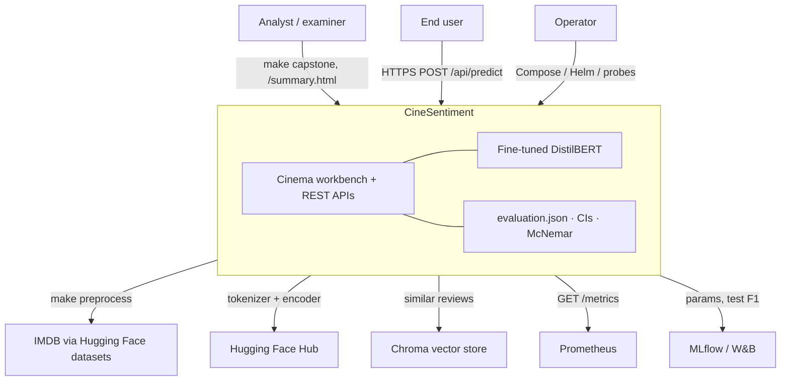

**Caption (Figure A.1).** CineSentiment sits between human roles (analyst, end user, operator) and external data/model/observability systems. Training data are regenerated locally from IMDB; they are not stored in git.

---

## A.4 Container diagram (C4 Level 2) — main architecture

This is the **main runtime architecture**. Containers are independently deployable processes or durable stores.

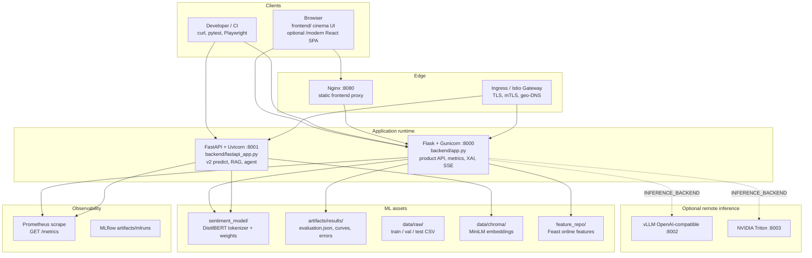

**Caption (Figure A.2).** Main container architecture. Flask remains the product surface (UI + academic metrics). FastAPI is a parallel v2 API. Model weights and `evaluation.json` are the two authoritative runtime artifacts.

| Container | Technology | Responsibility |
|-----------|------------|----------------|
| Cinema UI | HTML5, Bootstrap 5, Chart.js | Analyze, compare, metrics, insights, developer portal |
| React SPA | Vite, React 18, TypeScript | Optional `/modern/` surface |
| Flask API | Flask 3, Gunicorn | Inference, explainability, stats, billing, webhooks |
| FastAPI v2 | FastAPI, Uvicorn | Async predict, RAG, agent graph |
| DistilBERT | PyTorch, Transformers | Local sequence classification (`max_length=256`) |
| Evaluation store | JSON / CSV / PNG | Test metrics, CIs, baselines, hypothesis tests |
| Chroma | sentence-transformers | Optional nearest-neighbour reviews |
| Nginx / Ingress | Alpine Nginx, K8s Ingress, Istio | Static hosting and TLS termination |

---

## A.5 Component diagram (C4 Level 3) — Flask backend

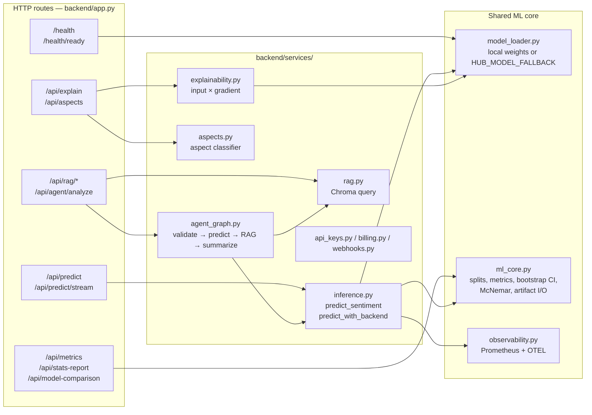

**Caption (Figure A.3).** Flask components. All prediction paths converge on `model_loader` + `inference`. Statistical endpoints read `evaluation.json` via `ml_core`; they do not invent numbers when artifacts are missing (HTTP 404/503).

---

## A.6 Training and evaluation pipeline

Offline science is a directed acyclic graph invoked by the Makefile. Training uses **train only**. Validation is for monitoring and threshold exploration. **Test metrics are reported once**.

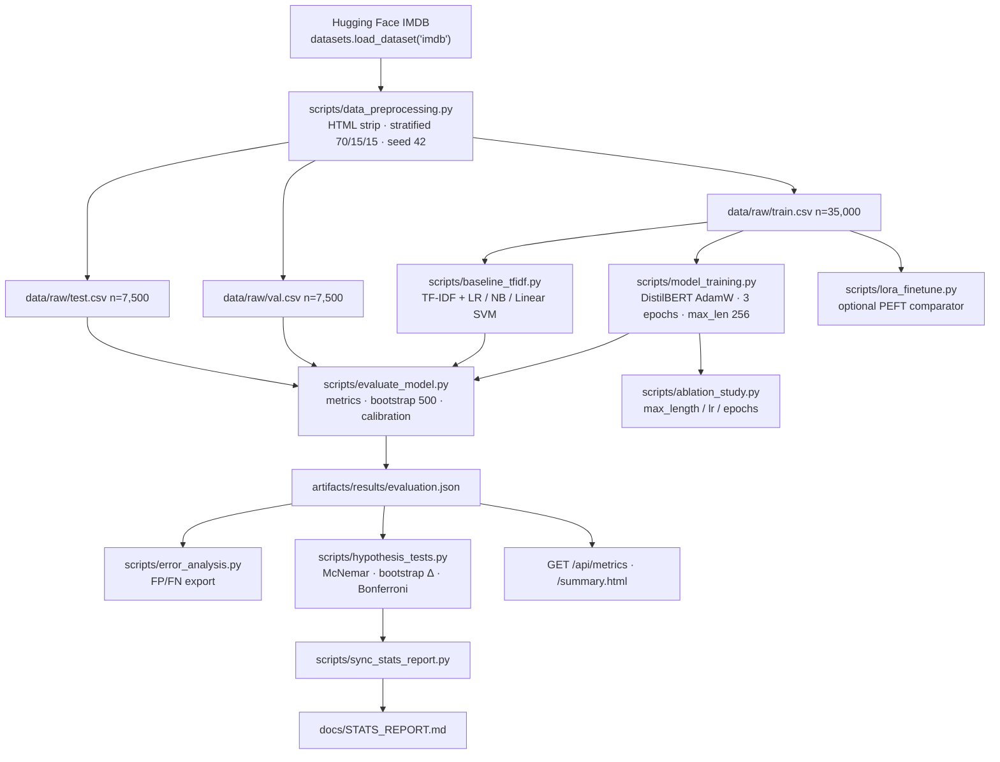

**Caption (Figure A.4).** Academic pipeline. `make capstone` executes baseline → train → evaluate → error analysis → insight curves → hypothesis tests → pytest. The test split is not used for model selection.

---

## A.7 Online inference sequence

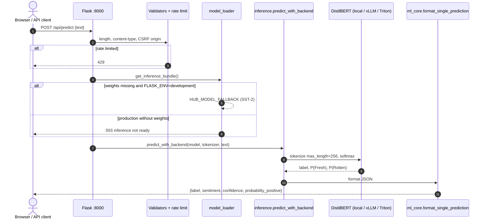

**Caption (Figure A.5).** Happy-path inference. Confidence is \(\max(P, 1-P)\). The same truncation length is used in training, evaluation, and serving.

---

## A.8 Explainability and optional agent/RAG path

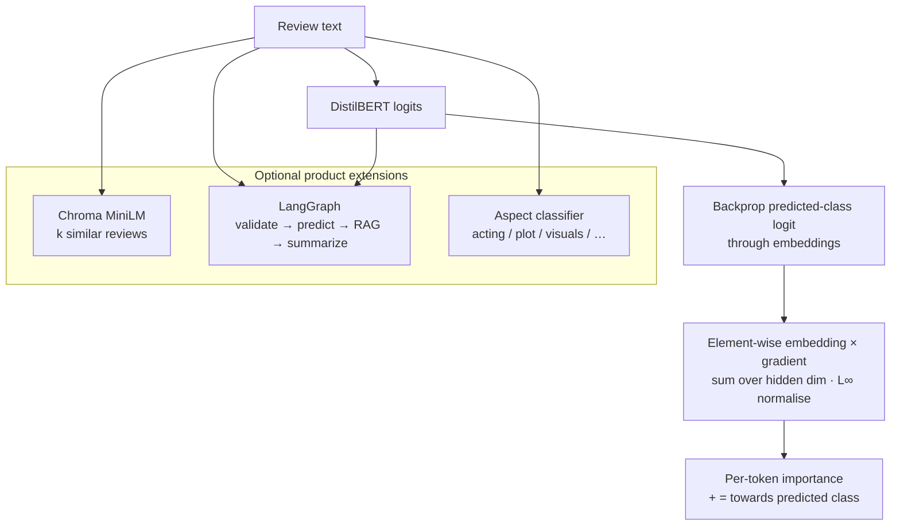

**Caption (Figure A.6).** Input × gradient is a first-order, model-derived attribution used by `/api/explain`. The frontend lexicon heatmap is a **separate heuristic** and must not be cited as model attribution. RAG and the LangGraph agent are optional (`RAG_ENABLED`, `AGENT_ENABLED`).

---

## A.9 Deployment topology

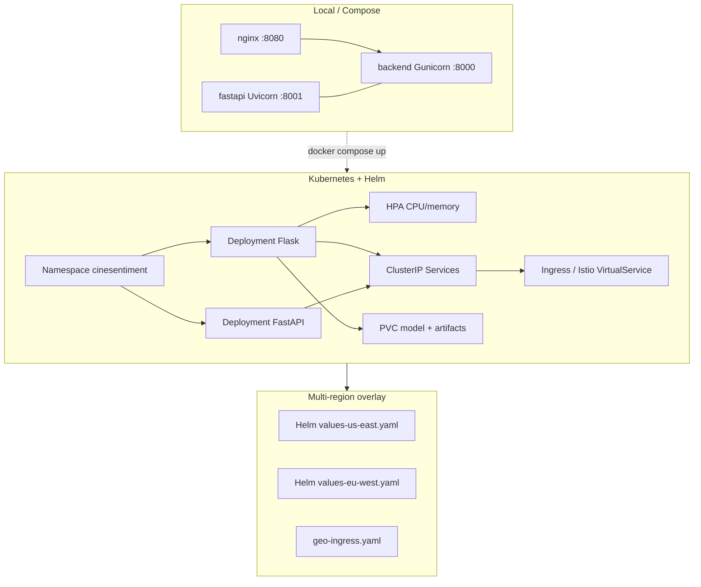

**Caption (Figure A.7).** Three deployment grades: Compose for demonstration, Helm/Kubernetes for production-style serving, optional multi-region values with Istio mTLS. Health probes use `/health/ready`.

| Target | Entry |
|--------|--------|
| Development | `make serve` → `http://127.0.0.1:8000` |
| Production WSGI | `make serve-prod` (Gunicorn) |
| Compose | `docker compose up` — frontend :8080, Flask :8000, FastAPI :8001 |
| Kubernetes | `deploy/kubernetes/` · `make k8s-validate` |
| Helm | `deploy/helm/cinesentiment/` · `values-us-east.yaml` / `values-eu-west.yaml` |

---

## A.10 CI/CD pipeline

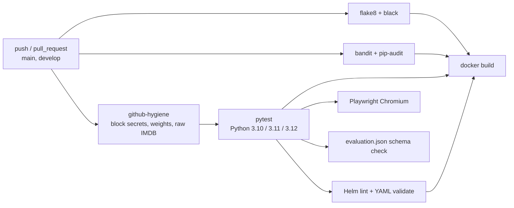

**Caption (Figure A.8).** GitHub Actions workflow `.github/workflows/ci-cd.yml`. Tests inject `HUB_MODEL_FALLBACK` so CI does not require committed DistilBERT weights. Hygiene fails the build if `data/raw/*.csv` or `*.safetensors` are tracked.

---

## A.11 Health and configuration model

| Probe | Semantics |
|-------|-----------|
| `GET /health` | Liveness. Always process-alive; JSON includes `inference_ready`, `model_source`, `model_is_finetuned` |
| `GET /health/ready` | Readiness. HTTP 200 only when prediction is allowed (local weights or explicit hub fallback) |

**Development:** if `sentiment_model/` lacks `model.safetensors` / `pytorch_model.bin` and `FLASK_ENV=development`, the loader selects `HUB_MODEL_FALLBACK` (`distilbert-base-uncased-finetuned-sst-2-english`) so the UI does not present a false “model loading” state.  
**Production:** `SECRET_KEY` is required; CORS allowlist; CSRF on mutating routes; `RATE_LIMIT_*`; CSP + HSTS.

Configuration is environment-driven (`.env.example`). Never commit `.env`.

---

## A.12 Security controls

| Control | Implementation |
|---------|----------------|
| Secrets | `.env` gitignored; hygiene script blocks credentials and API-key registries |
| Transport | TLS at Ingress; Istio `PeerAuthentication` mTLS in-cluster |
| Origin | CORS allowlist; CSRF origin check on POST/PUT |
| Abuse | Per-IP rate limits (`RATE_LIMIT_PER_MINUTE`, `RATE_LIMIT_PREDICT_PER_MINUTE`) |
| Headers | CSP, HSTS (non-dev) |
| Supply chain | Dependabot, pip-audit, CodeQL, Bandit |
| Model files | Weights not stored in git ([MODEL_WEIGHTS.md](MODEL_WEIGHTS.md)) |

---

## A.13 Layer mapping to repository paths

| Layer | Path | Notes |
|-------|------|-------|
| Presentation | `frontend/`, `frontend-react/` | Multi-page cinema UI; optional React SPA |
| Application | `backend/app.py`, `backend/fastapi_app.py` | Dual HTTP surfaces |
| Domain services | `backend/services/` | Inference, XAI, RAG, aspects, billing |
| Statistical core | `backend/ml_core.py` | Metrics, CIs, McNemar, artifact I/O |
| Pipeline | `scripts/` | Train, evaluate, baseline, ablation, RAG index |
| Evidence | `artifacts/results/` | Versioned evaluation for UI and reports |
| Notebooks | `notebooks/` | EDA, error analysis, model comparison |
| Delivery | `deploy/`, `Dockerfile`, `docker-compose.yml` | Compose, K8s, Helm, Triton repo |
| Verification | `tests/`, `e2e/` | pytest + Playwright |

Full tree: [PROJECT_STRUCTURE.md](../PROJECT_STRUCTURE.md).

---

## A.14 Architectural decisions (selected)

| Decision | Rationale | Consequence |
|----------|-----------|-------------|
| DistilBERT over BERT-base | 40% smaller, ~60% faster; sufficient for binary IMDB at capstone compute | Slight capacity trade-off vs full BERT |
| Dual Flask + FastAPI | Flask already serves static UI and academic routes; FastAPI adds typed v2 without breaking examiners’ URLs | Two processes to operate |
| Test split reported once | Prevents inadvertent test-set tuning | Validation used only for monitoring |
| Bootstrap percentile CI (500) | Non-parametric; no normality assumption on accuracy | Wider intervals than analytic binomial CIs |
| Honest non-significance | McNemar p ≈ 0.15 vs TF-IDF | DistilBERT is shipped for product flexibility, not a claimed significant win |
| Hub fallback in development | UI remains demonstrable without 250+ MB weights in git | Production must set weights or an explicit fallback |

---

## A.15 Related documents

| Document | Role |
|----------|------|
| [METHODOLOGY.md](METHODOLOGY.md) | Experimental protocol, related work, ablation |
| [STATS_REPORT.md](STATS_REPORT.md) | Authoritative test metrics and hypothesis tests |
| [MODEL_CARD.md](MODEL_CARD.md) | Intended use and limitations |
| [SILICON_VALLEY_STACK.md](SILICON_VALLEY_STACK.md) | MLflow, RAG, K8s, Istio extensions |
| [DEPLOYMENT.md](DEPLOYMENT.md) | Operator runbooks |
| [openapi.yaml](openapi.yaml) | HTTP contract |
| README §3 | AI/ML figures M.1–M.12 (use-case through module diagram) |

---

# Part B — AI and ML architecture

CS-style views of every machine-learning function that exists in the tree. README §3 renders Figures **M.1–M.12**. This part records **wiring rules**, extra state/data-flow diagrams, and what is *not* claimed.

## B.1 Inventory (mapped to code)

| Concern | Code | Serve path? |
|---------|------|-------------|
| DistilBERT IMDB classifier | `scripts/model_training.py`, `sentiment_model/` | Yes — Flask, FastAPI |
| TF-IDF LR / NB / SVM | `scripts/baseline_tfidf.py` | No — evaluation artefact only |
| LoRA PEFT | `scripts/lora_finetune.py`, `sentiment_model_lora/` | No |
| LLM zero-shot | `scripts/llm_baseline.py` | No |
| Input × gradient XAI | `backend/services/explainability.py` | Yes — `/api/explain` |
| Aspect polarity | `aspects.py`, `aspect_classifier.py` | Yes — `/api/aspects`, analyze |
| Tone arc | sentence split + per-sentence predict | Yes — analyze `arc` |
| Multilingual XLM-R | `multilingual.py`, `language.py` | Yes — if lang ≠ en |
| RAG MiniLM + Chroma | `rag.py`, `scripts/index_rag.py` | Optional `RAG_ENABLED` |
| LangGraph agent | `agent_graph.py` | Optional `AGENT_ENABLED` |
| Remote vLLM / Triton | `remote_inference.py` | FastAPI + agent only |
| Feast text stats | `feature_store.py` | `/api/features` — not a model input |
| MLflow / W&B | `experiment_tracking.py` | Train jobs only |

## B.2 Wiring rules (read before drawing)

1. Flask `/api/predict` and `/api/analyze` call `predict_sentiment` (local HF) and may route non-English to XLM-R. They do **not** read `INFERENCE_BACKEND`.
2. FastAPI `/api/v2/predict` and LangGraph `predict` call `predict_with_backend`.
3. RAG output is never concatenated into DistilBERT tokens or logits.
4. LoRA adapters and GPT-4o-mini baselines are offline comparators.
5. Triton `deploy/triton/model_repository/.../model.py` is a lexicon smoke backend unless replaced.
6. There is **no MCP (Model Context Protocol) server** in this repository. External agents should use the REST API (`docs/openapi.yaml`).

## B.3 Figure index M.1–M.12

Reproduced with captions in README §3.

| Figure | CS type | Subject |
|--------|---------|---------|
| M.1 | Use case | All AI-facing functions |
| M.2 | Layered | Presentation → ML → loader → evidence |
| M.3 | Neural block | DistilBERT encoder + 2-way head |
| M.4 | Family / package | Served models vs offline comparators |
| M.5 | Activity | Language + backend routing |
| M.6 | Sequence | Composite `/api/analyze` |
| M.7 | Data flow | RAG index vs query |
| M.8 | State | LangGraph linear graph |
| M.9 | Activity | Aspects + tone arc |
| M.10 | Data flow | Input × gradient |
| M.11 | Deployment-ish | MLflow / W&B / Feast |
| M.12 | Class / module | `backend/` ML units |

## B.4 Model-loader state (extra)

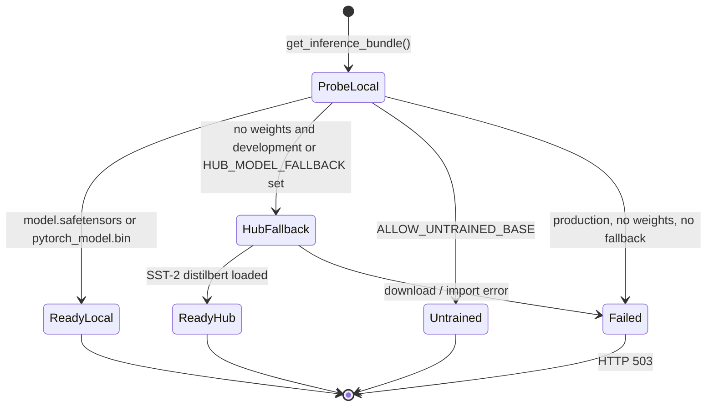

**Figure M.13.** Loader states (`backend/model_loader.py`). Production without weights must fail closed. Development may serve `distilbert-base-uncased-finetuned-sst-2-english` so the UI is not stuck on “model loading”.

## B.5 Level-1 data flow (extra)

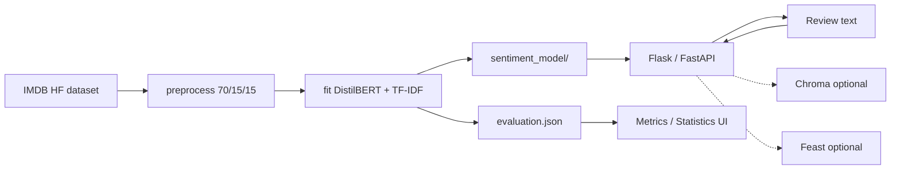

**Figure M.14.** Level-1 data flow. Two stores of truth: weights (for labels) and `evaluation.json` (for reported metrics). Dotted edges are optional product extensions.

## B.6 Training sequence with tracking (extra)

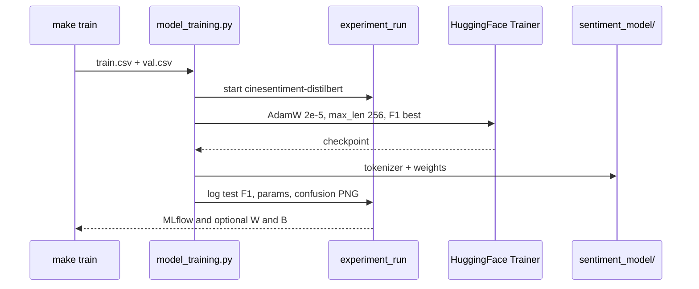

**Figure M.15.** Train-job sequence. Tracking is a side effect of training, not of `/api/predict`. Disable with `MLFLOW_ENABLED=false` and `WANDB_MODE=disabled`.

## B.7 AI-specific decisions

| Decision | Rationale | Consequence |
|----------|-----------|-------------|
| Linear LangGraph, not a ReAct loop | Capstone needs a deterministic demo graph | No tool-selection; RAG always attempted |
| RAG as neighbour display | Avoid claiming retrieval-augmented *accuracy* without an ablation | Neighbours are UX/context |
| Aspects via lexicon + optional TF-IDF | A second transformer head is disproportionate | Aspect quality tracks keyword coverage |
| XAI = input × gradient | Interactive latency; IG/SHAP too slow for the API | First-order saliency only |
| Dual Flask vs FastAPI inference entry | Preserve examiner URLs on :8000 | Remote backends easy to miss on Flask |

---

*Architecture version 2.3.0. Part A: C4 software views. Part B: CS diagrams of the ML system as implemented.*
