# Theoretical Framework — CineSentiment

**Document type:** Curriculum alignment (Stanford, MIT, Harvard, NUS) mapped onto artefacts  
**Audience:** Examiners who know *courses*, not a paper dump  
**Companion:** [METHODOLOGY.md](METHODOLOGY.md) · [STATS_REPORT.md](STATS_REPORT.md) · [ARCHITECTURE.md](ARCHITECTURE.md)

This chapter records **only methods that exist in code**. Framing is the standard machine-learning and inference syllabus at four schools — the same ideas, different course codes. Figure prefix **T.**

You do **not** need to read a stack of authors. If you have taken (or can name) **CS229 + CS224N**, **6.036 + 6.041**, **CS181 + Stat 110**, or **CS3244 + CS4248 + ST2132**, you already have the theory. This repo is those modules applied to IMDB sentiment.

---

## T.0 Curriculum map — four schools, one project

| What the repo does | Stanford | MIT | Harvard | NUS |
|--------------------|----------|-----|---------|-----|
| Supervised binary classification, logistic / NB / SVM baselines | **CS229** | **6.036** (now 6.390) | **CS181** | **CS3244** |
| Train / val / test split; select on val; test once | CS229 | 6.036 | CS181 | CS3244 |
| TF-IDF, n-grams, text classification | **CS224N** (vector space) | **6.861** NLP | CS181 + text labs | **CS4248** |
| Transformers, self-attention, BERT-style fine-tune | **CS224N** | 6.S191 / 6.861 | CS287 (grad NLP) | CS4248 / **CS5242** |
| Cross-entropy, softmax, SGD-style training | CS229 / CS231N | 6.036 / 6.S191 | CS181 | CS3244 / CS5242 |
| Confusion matrix, F1, ROC | CS229 | 6.036 | CS181 | CS3244 |
| Bootstrap CI, hypothesis tests, paired comparison | **CS109** / STATS 200 | **6.041** / **18.05** | **Stat 110** + CS109 | **ST2131** + **ST2132** |
| Gradient saliency (input × gradient) | **CS231N** | 6.S191 | CS181 interpretability | CS5242 |
| Optional retrieval (neighbours, not fused) | CS224N retrieval | 6.861 | CS287 | CS4248 |

```mermaid
flowchart TB
    subgraph Stanford["Stanford"]
        S229["CS229  supervised ML"]
        S224["CS224N  NLP / Transformers"]
        S231["CS231N  saliency"]
        S109["CS109  bootstrap / reporting"]
    end

    subgraph MIT["MIT"]
        M036["6.036  ML"]
        M041["6.041 / 18.05  probability"]
        M191["6.S191  DL"]
    end

    subgraph Harvard["Harvard"]
        H181["CS181  ML"]
        H110["Stat 110  probability"]
    end

    subgraph NUS["NUS"]
        N3244["CS3244  ML"]
        N4248["CS4248  NLP"]
        N2132["ST2132  statistical inference"]
    end

    subgraph Repo["This capstone"]
        Prot["70/15/15  val select  test once"]
        Base["TF-IDF + logistic / NB / SVM"]
        Enc["DistilBERT fine-tune"]
        Inf["Bootstrap CI  McNemar"]
        XAI["Input x gradient"]
    end

    S229 --> Prot
    N3244 --> Prot
    M036 --> Prot
    H181 --> Prot
    S224 --> Enc
    N4248 --> Enc
    M191 --> Enc
    S224 --> Base
    N4248 --> Base
    S109 --> Inf
    N2132 --> Inf
    M041 --> Inf
    H110 --> Inf
    S231 --> XAI
```

**Figure T.0.** Same undergraduate/MSc ML stack, four course-number systems. Defence language: “hold-out like CS229/CS3244; encoder like CS224N/CS4248; inference like ST2132/CS109.”

---

## T.0b What lands in which file

| Syllabus topic | Instantiation |
|----------------|---------------|
| Binary labels \(y\in\{0,1\}\) | Fresh / Rotten |
| Hold-out generalisation | Test reported **once** |
| Stratified split | 70/15/15, seed 42 |
| Linear baselines | `baseline_tfidf.py` |
| Transformer fine-tune | `model_training.py` → `sentiment_model/` |
| Cross-entropy + AdamW | Hugging Face Trainer |
| Threshold \(\tau=0.5\) | Equal costs, balanced classes |
| F1, ROC, confusion rates | `evaluation.json` |
| Bootstrap 95% CI | `ml_core.py`, \(B=500\) |
| Paired test of two classifiers | McNemar + bootstrap \(\Delta\) on the **same** 7,500 rows |
| Saliency | `POST /api/explain` |
| Retrieval optional | Chroma; **not** fused into logits |

**Not in the syllabus of this repo.** MCP servers; SHAP/LIME as the live explainer; *k*-fold CV; claiming RAG improved F1.

---

## T.1 Knowledge architecture — how theory drives the system

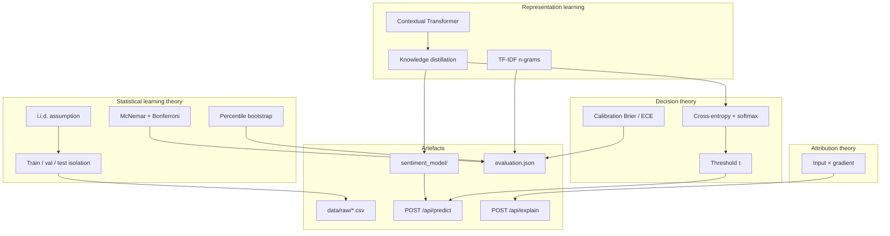

**Figure T.1.** Theoretical framework of the capstone. CS229/CS3244 constrain the **protocol**; CS224N/CS4248 supply **two model families**; ST2132/CS109 turn logits into a reportable claim. Everything terminates in files examiners can open.

---

## T.2 Problem formulation

Let \(x\) be review text and \(y \in \{0,1\}\) with \(1 =\) Fresh. We estimate \(f_\theta(x) = P_\theta(y=1 \mid x)\) and apply

\[
\hat{y} = \mathbf{1}[f_\theta(x) \ge \tau], \quad \tau = 0.5 \text{ unless swept}.
\]

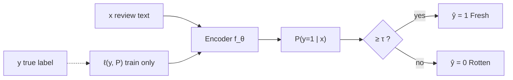

**Figure T.2.** Supervised classification as conditional probability + threshold (CS229 / CS181 / CS3244). Training minimises empirical risk on **train.csv only**. Test labels are used solely in `evaluate_model.py` / `STATS_REPORT.md`.

---

## T.3 Generalisation protocol (no leakage)

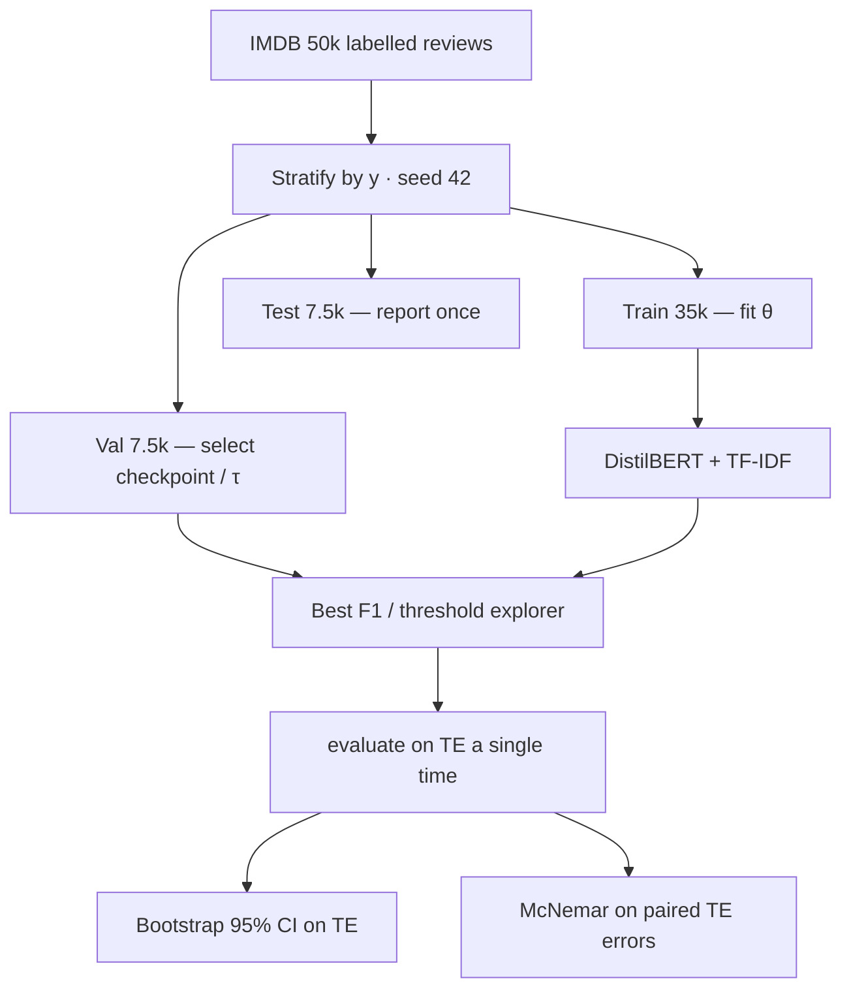

**Figure T.3.** Hold-out protocol (CS229, 6.036, CS3244). The test split estimates risk; it is not a tuning knob. Stratification keeps the 50/50 prior so accuracy is not an artefact of imbalance.

---

## T.4 Two representation families

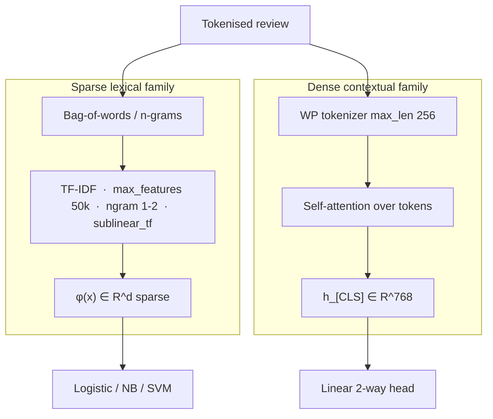

**Figure T.4.** Two feature geometries on the same \((x,y)\) (CS224N / CS4248). The paired test asks whether **error patterns** differ.

---

## T.5 Classical stack — TF-IDF to linear models

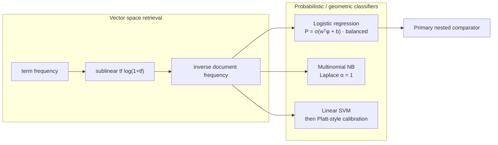

**Figure T.5.** TF-IDF + logistic regression is the **pre-registered** CS229/CS3244 baseline. Naïve Bayes and a margin SVM are nested comparators; calibrated SVM probabilities make Brier/ECE defined.

---

## T.6 Self-attention as used in DistilBERT

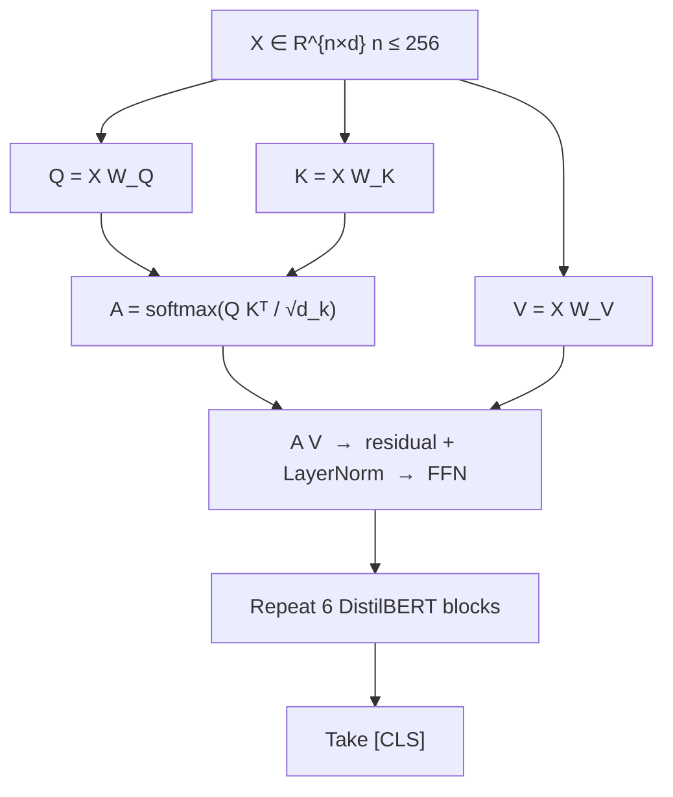

**Figure T.6.** Scaled dot-product attention as in CS224N / 6.S191, inside DistilBERT. We fine-tune Hugging Face weights; we do not re-implement attention. Truncation at 256 is ablated.

---

## T.7 Distillation and transfer learning

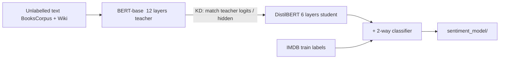

**Figure T.7.** CS224N-style transfer: a BERT-family student encoder, then IMDB fine-tune. This repo does not pre-train BERT-base.

---

## T.8 Empirical risk, optimiser, and selection

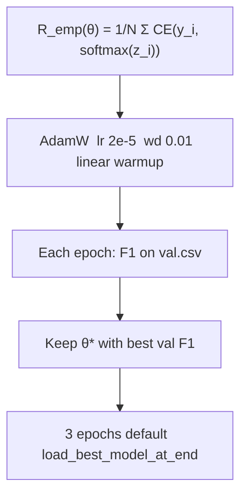

**Figure T.8.** Cross-entropy as NLL of a two-class softmax (CS229). **Selection uses validation F1, never test F1** (CS3244 / 6.036).

---

## T.9 Decision theory and operating point

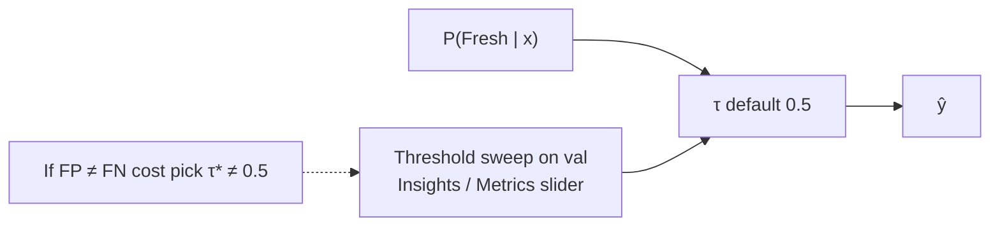

**Figure T.9.** Default \(\tau=0.5\) is the equal-cost Bayes point on a balanced problem (CS229). The UI slider is **validation**; primary tables freeze \(\tau=0.5\) on test.

---

## T.10 Evaluation taxonomy

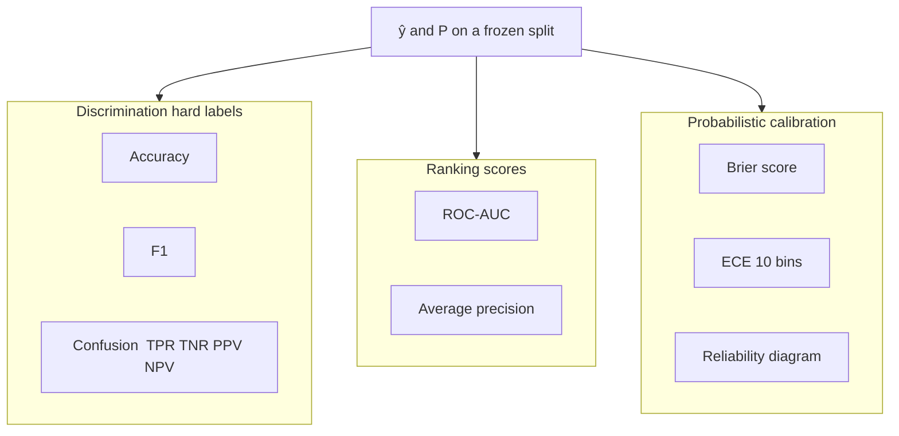

**Figure T.10.** Three questions from CS229 / CS181: (i) labels, (ii) ranking, (iii) calibration. Lead metrics: **test F1 + ROC-AUC**.

---

## T.11 Percentile bootstrap

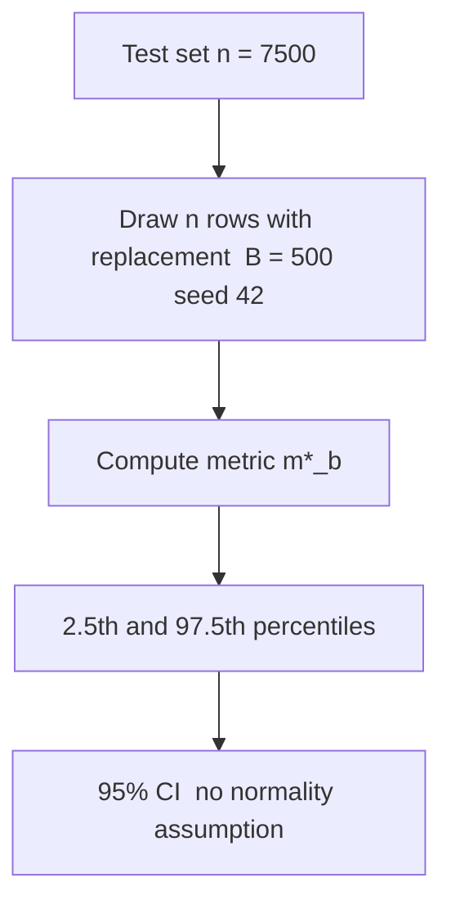

**Figure T.11.** Percentile bootstrap in `ml_core.py` (CS109 / 18.05 / ST2132). The interval is sampling variability of the **test estimator**. \(B=500\) is a compute compromise.

---

## T.12 Paired hypothesis tests

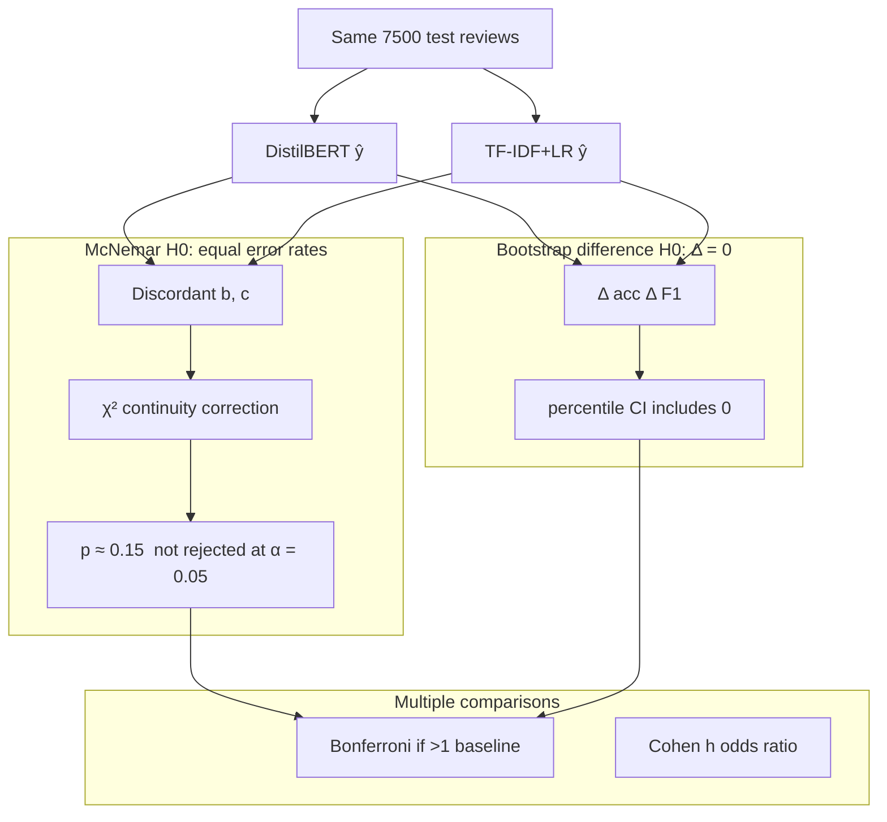

**Figure T.12.** Two complementary ST2132/CS109 tests. McNemar: do **error patterns** differ? Bootstrap \(\Delta\): does **metric magnitude** differ? On this split both fail to reject at 5%. **Report the tie.**

---

## T.13 Calibration theory (extra)

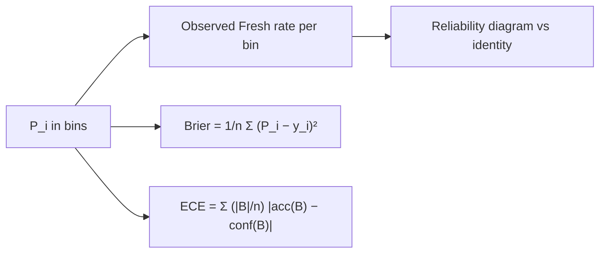

**Figure T.13.** High AUC can still be miscalibrated (CS229 evaluation). Insights plots the reliability diagram. Calibration is **reported**, not temperature-scaled at serve time by default.

---

## T.14 Attribution theory vs implementation (extra)

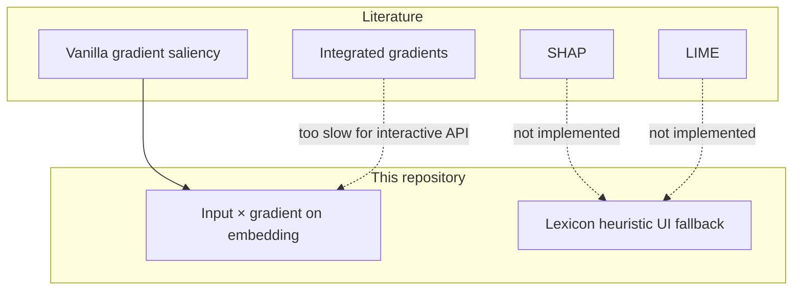

**Figure T.14.** Live XAI is first-order **input × gradient** (CS231N saliency). Not SHAP, not integrated gradients. The UI lexicon fallback is labelled as a heuristic.

---

## T.15 LoRA as low-rank transfer (extra, offline)

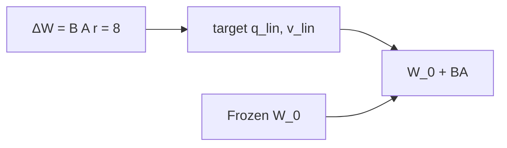

**Figure T.15.** LoRA is an **offline** CS224N-style PEFT comparator (`make lora-quick`). Serving still uses one DistilBERT checkpoint.

---

## T.16 Dense retrieval (extra, not fused)

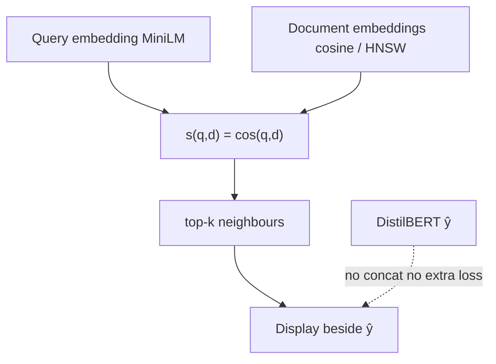

**Figure T.16.** Dense retrieval (CS224N / CS4248) as **display context**. Neighbours are not concatenated into DistilBERT, so we do not claim a retrieval-augmented **F1** gain.

---

## How to use this chapter in a defence

1. Show **T.0** — four schools, one stack.  
2. Protocol **T.3** — CS229 / CS3244 hold-out.  
3. Two geometries **T.4** — CS224N / CS4248.  
4. Tests **T.12** — ST2132 / CS109; say the models are **tied**.  
5. Point to `evaluation.json`.

---

*If a method is not in T.0, do not imply it was used. Course numbers are the syllabus names, not a claim that the author enrolled at those universities.*
