# Theoretical Framework — CineSentiment

**Document type:** Mapping from statistical / ML theory to artefacts in this repository  
**Audience:** Examiners (statistics, machine learning, software)  
**Companion:** [METHODOLOGY.md](METHODOLOGY.md) · [STATS_REPORT.md](STATS_REPORT.md) · [ARCHITECTURE.md](ARCHITECTURE.md)

This chapter records **only theories that are instantiated in code or evaluation artefacts**. Each figure is a *theory → implementation* architecture. Figure prefix **T.** does not collide with C4 (**A.**), ML runtime (**M.**), or UI screenshots (**1–16**).

Principal diagrams **T.1–T.12** are reproduced in README §4. Figures **T.13–T.16** live here.

---

## T.0 Inventory — theory used, and where it lands

This table is a **lookup**, not a bibliography to paste into the report. Cite a row only if that chapter actually discusses the method.

| Theory | Canonical reference | Instantiation in this project |
|--------|---------------------|-------------------------------|
| Supervised binary classification | Vapnik (1998); Hastie et al. (2009) | \(y \in \{0,1\}\), Fresh vs Rotten |
| i.i.d. + held-out generalisation | Devroye et al. (1996) | Test split reported **once**; no test tuning |
| Stratified sampling | Cochran (1977) | 70/15/15 by label, seed 42 |
| Bag-of-words / TF-IDF | Salton & Buckley (1988) | `TfidfVectorizer` unigrams+bigrams, `sublinear_tf` |
| Logistic regression (Bernoulli GLM) | McCullagh & Nelder (1989) | Primary classical baseline |
| Naïve Bayes + Laplace smoothing | Manning et al. (2008) | `MultinomialNB(alpha=1.0)` |
| Soft-margin linear SVM + calibration | Cortes & Vapnik (1995); Platt (1999) | `CalibratedClassifierCV(LinearSVC)` |
| Self-attention / Transformer | Vaswani et al. (2017) | DistilBERT 6-block encoder |
| BERT pre-training + fine-tuning | Devlin et al. (2019) | `distilbert-base-uncased` then IMDB head |
| Knowledge distillation | Hinton et al. (2015); Sanh et al. (2019) | DistilBERT instead of BERT-base |
| Cross-entropy / softmax | Goodfellow et al. (2016) | Sequence-classification loss |
| AdamW, weight decay, warmup | Loshchilov & Hutter (2019) | Trainer defaults in `model_training.py` |
| Model selection on validation F1 | Hastie et al. (2009) | `load_best_model_at_end` on F1 |
| Bayes decision / threshold \(\tau\) | Duda et al. (2001) | \(\hat{y}=\mathbb{1}[P\ge 0.5]\) unless swept |
| Confusion-matrix rates | Fawcett (2006) | TPR, TNR, FPR, FNR, PPV, NPV |
| F1 (harmonic mean) | van Rijsbergen (1979) | Primary academic metric with accuracy |
| ROC-AUC / PR-AP | Hanley & McNeil (1982); Manning et al. | Insights curves |
| Probability calibration, Brier, ECE | Brier (1950); Guo et al. (2017) | 10-bin reliability, Insights page |
| Percentile bootstrap CI | Efron & Tibshirani (1993) | 500 resamples, seed 42 |
| McNemar paired test | McNemar (1947) | Continuity-corrected χ² vs TF-IDF |
| Bootstrap difference test | Efron & Tibshirani (1993) | Δ accuracy, Δ F1 |
| Bonferroni correction | Bonferroni (1936) | When >1 baseline is tested |
| Effect size (Cohen’s *h*, OR) | Cohen (1988) | Discordant pairs in `ml_core` |
| Ablation | Cohen & Howe (1988) | max_length, lr, epochs |
| Input × gradient saliency | Simonyan et al. (2014); Sundararajan et al. (2017) | `/api/explain` (first-order, not IG/SHAP) |
| LoRA | Hu et al. (2022) | Offline PEFT comparator only |
| Dense retrieval / RAG | Lewis et al. (2020); Reimers & Gurevych (2019) | MiniLM + Chroma; **not** fused into logits |
| Cross-lingual transfer | Conneau et al. (2020) | Optional XLM-R if `lang ≠ en` |

**Not claimed.** MCP servers; SHAP/LIME as the live explainer (cited as related work only); *k*-fold CV; retrieval-augmented *accuracy* without an ablation.

---

## T.1 Knowledge architecture — how theory drives the system

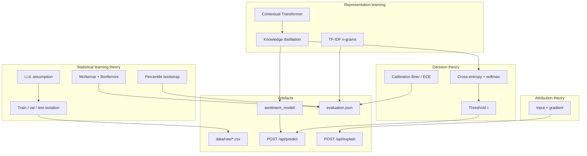

**Figure T.1.** Theoretical framework of the capstone. Statistics constrain the **protocol**; representation learning supplies **two model families**; decision theory turns logits into labels and probabilities; attribution is a separate first-order map. Everything terminates in files examiners can open.

---

## T.2 Problem formulation

Let \(x\) be review text and \(y \in \{0,1\}\) with \(1 =\) Fresh. We estimate \(f_\theta(x) = P_\theta(y=1 \mid x)\) and apply

\[
\hat{y} = \mathbf{1}[f_\theta(x) \ge \tau], \quad \tau = 0.5 \text{ unless swept}.
\]

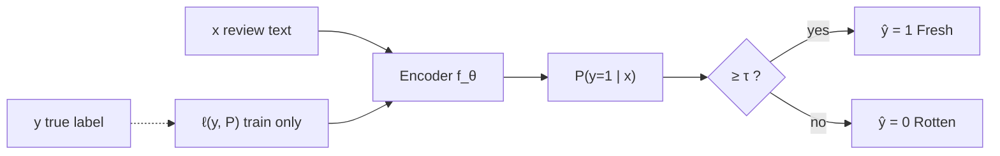

**Figure T.2.** Supervised classification as conditional probability + threshold (Duda et al., 2001). Training minimises empirical risk on **train.csv only**. Test labels are used solely in `evaluate_model.py` / `STATS_REPORT.md`.

---

## T.3 Generalisation protocol (no leakage)

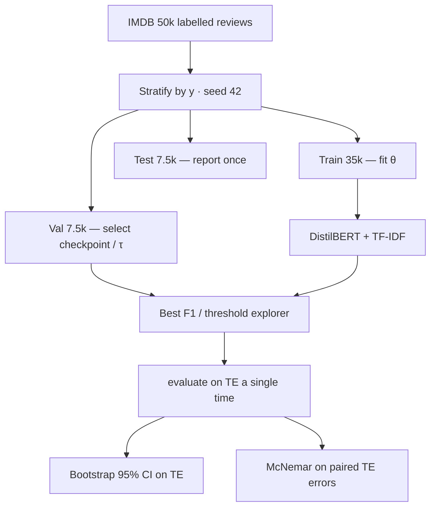

**Figure T.3.** Statistical learning protocol. The test split is an **estimator of risk**, not a tuning knob (Hastie et al., 2009). Stratification preserves the 50/50 class prior so accuracy is not dominated by imbalance.

---

## T.4 Two representation families

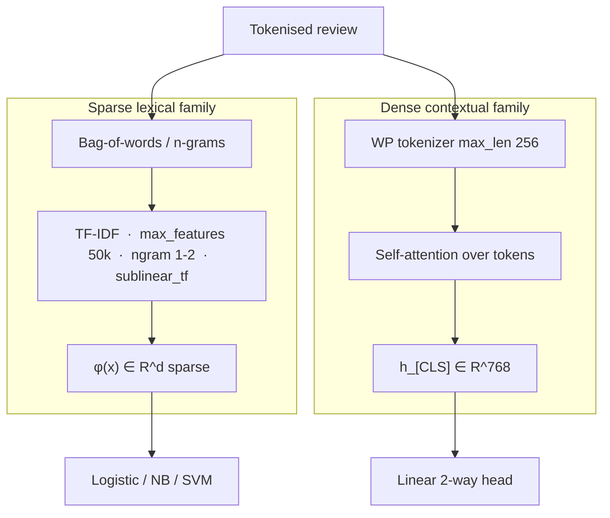

**Figure T.4.** The academic comparison is **not** “neural vs magic”; it is two feature geometries on the **same** \((x,y)\) (Salton & Buckley, 1988 vs Vaswani et al., 2017). McNemar tests whether their **error patterns** differ, not whether embeddings “exist”.

---

## T.5 Classical stack — TF-IDF to linear models

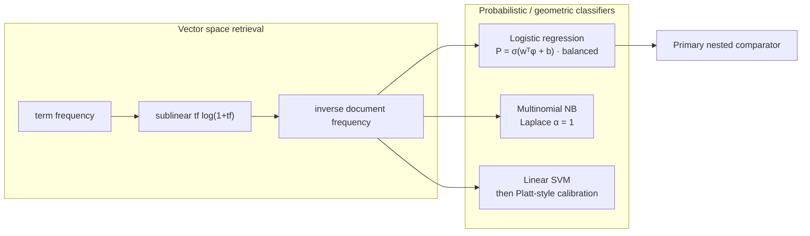

**Figure T.5.** TF-IDF + logistic regression is the **pre-registered** baseline (GLM with logit link). Naïve Bayes adds a generative independence assumption; Linear SVM maximises margin, then `CalibratedClassifierCV` supplies probabilities so Brier/ECE are defined.

---

## T.6 Self-attention as used in DistilBERT

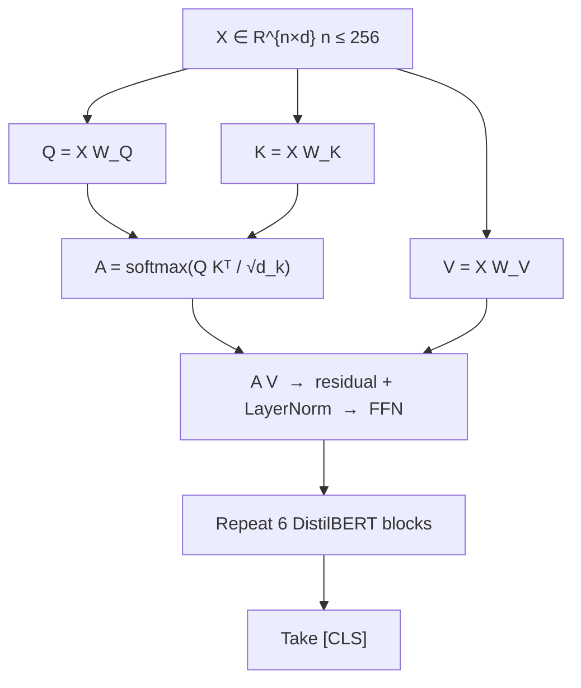

**Figure T.6.** Scaled dot-product attention (Vaswani et al., 2017, Eq. 1) inside each DistilBERT block. We do **not** re-implement attention; we fine-tune Hugging Face `DistilBertForSequenceClassification`. Sequence length 256 is a **truncation bias** quantified in ablation (`max_length` ∈ {64, 128, 256, 512}).

---

## T.7 Distillation and transfer learning

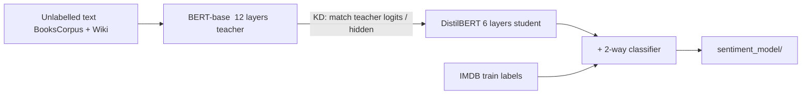

**Figure T.7.** Two stacked transfers. (1) **Knowledge distillation** (Hinton et al., 2015; Sanh et al., 2019) compresses BERT-base into DistilBERT *before* this project. (2) **Inductive transfer**: we fine-tune that student on IMDB. We do not train BERT-base from scratch; compute is the reason DistilBERT was chosen (ARCHITECTURE ADR).

---

## T.8 Empirical risk, optimiser, and selection

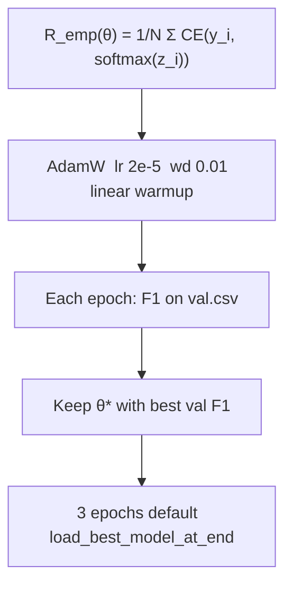

**Figure T.8.** Cross-entropy is the negative log-likelihood of a Bernoulli (via softmax on 2 logits). AdamW decouples weight decay from the adaptive step (Loshchilov & Hutter, 2019). **Selection uses validation F1, never test F1.**

---

## T.9 Decision theory and operating point

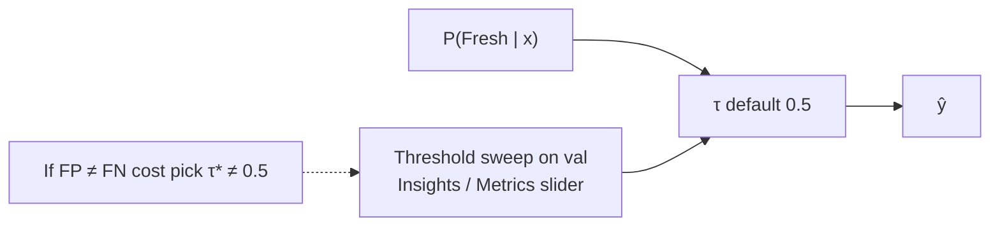

**Figure T.9.** The default 0.5 threshold is Bayes-optimal when classes are balanced and costs are equal (Duda et al., 2001). The UI slider is **exploratory on validation**; primary tables freeze \(\tau=0.5\) on test.

---

## T.10 Evaluation taxonomy

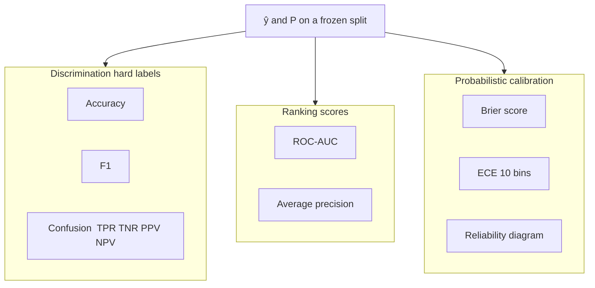

**Figure T.10.** Three questions that must not be collapsed (Guo et al., 2017; Fawcett, 2006): (i) are labels right, (ii) are scores ranked, (iii) are probabilities honest. This project reports all three; lead metrics for the capstone are **test F1 + ROC-AUC**, with CIs on the discrimination block.

---

## T.11 Percentile bootstrap

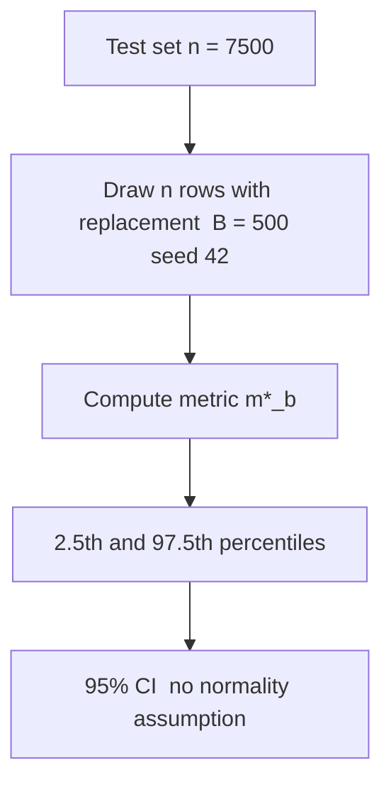

**Figure T.11.** Percentile bootstrap (Efron & Tibshirani, 1993) in `backend/ml_core.py`. The interval is a statement about **sampling variability of the test estimator**, not about Bayesian parameter posteriors. \(B=500\) is a compute compromise; it is not an infinite bootstrap.

---

## T.12 Paired hypothesis tests

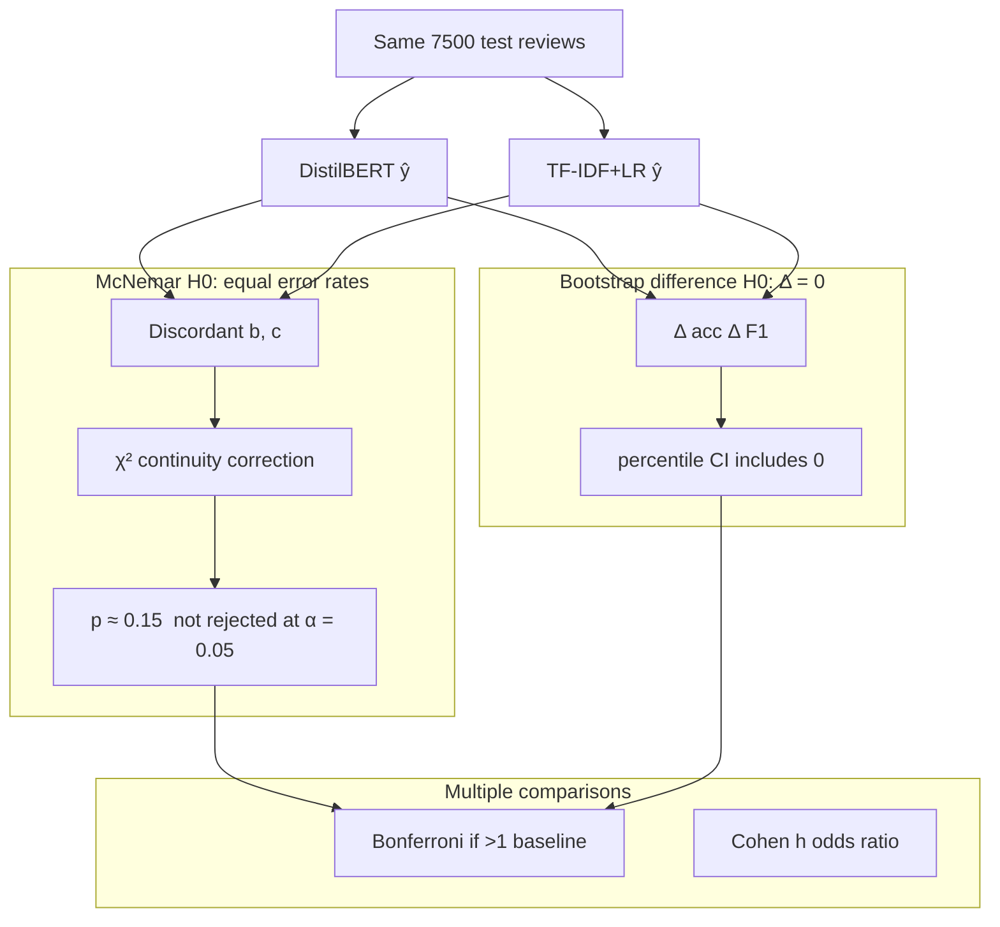

**Figure T.12.** Two complementary tests (Dietterich, 1998; McNemar, 1947). McNemar asks whether **error patterns** differ; bootstrap Δ asks whether **metric magnitude** differs. On this split both fail to reject at 5%. Bonferroni guards the family when NB and SVM are added. **We report non-significance rather than p-hack a winner.**

---

## T.13 Calibration theory (extra)

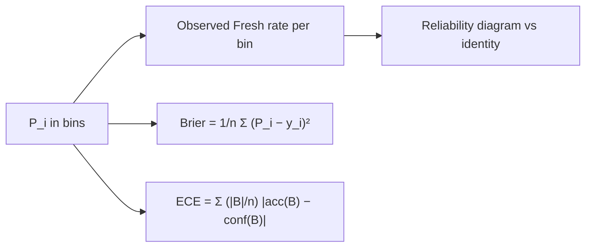

**Figure T.13.** A high-AUC model can still be miscalibrated (Guo et al., 2017). Insights (`/insights.html`) plots the reliability diagram. We do **not** apply temperature scaling at serve time in the default path; calibration is a **reported property**, not a post-hoc fix unless an operator chooses a new \(\tau\).

---

## T.14 Attribution theory vs implementation (extra)

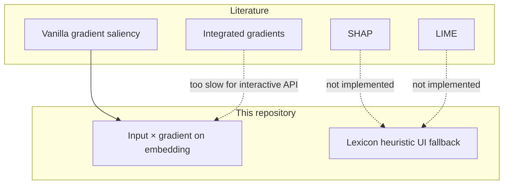

**Figure T.14.** Related work cites Ribeiro (2016) and Lundberg & Lee (2017). **Live XAI is first-order input × gradient** (Simonyan et al., 2014; cf. Sundararajan et al., 2017). That is an honest subset of the attribution literature, not a SHAP clone.

---

## T.15 LoRA as low-rank transfer (extra, offline)

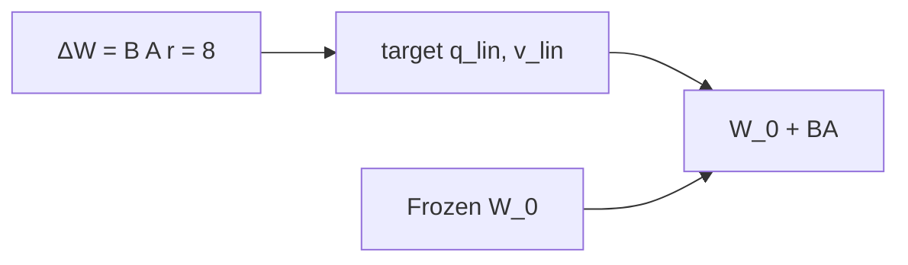

**Figure T.15.** LoRA (Hu et al., 2022) is an **offline comparator** (`make lora-quick`). Adapters are not merged into the Flask serving bundle. The theory is parameter-efficient fine-tuning; the engineering choice is to keep one DistilBERT checkpoint on the predict path.

---

## T.16 Dense retrieval (extra, not fused)

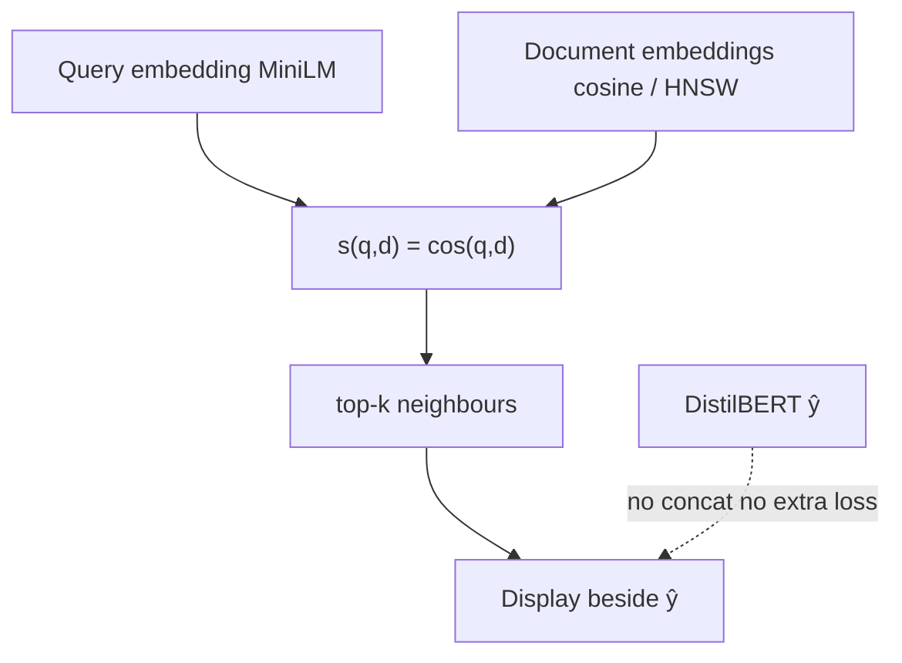

**Figure T.16.** Dense passage retrieval (Karpukhin et al., 2020; Lewis et al., 2020) as **user context**. We do not train a RAG reader that conditions DistilBERT on neighbours, so we do not claim a retrieval-augmented **F1** gain.

---

## How to cite this chapter in a report

1. Draw **T.1** on the theory slide.  
2. State the protocol with **T.3**.  
3. Contrast representations with **T.4**.  
4. Put McNemar on **T.12** and say the models are tied.  
5. Point to `evaluation.json` as the empirical realisation of T.10–T.12.

---

*Theory version 2.3.0. If a method is not in T.0, do not imply it was used.*
